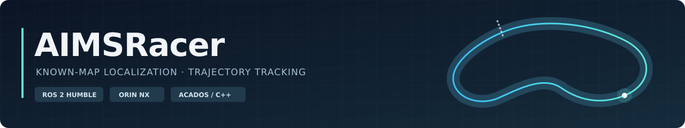

# AIMSRacer

  <strong>English</strong> · <a href="README.zh-CN.md">简体中文</a> 
  <a href="#quick-start">Quick start</a> · <a href="#architecture">Architecture</a> ·
  <a href="#defaults">Default configuration</a> · <a href="#results">Field results</a> · <a href="docs/README.md">Documentation</a>

A ROS 2 autonomous racing stack developed at **PolyU AIMS Lab**. AIMSRacer follows a saved trajectory in a prior LiDAR map, combining continuous local estimation, NDT global localization, and a native acados/C++ MPCC controller.

**Current platform:** Orin NX 16 GB · Ubuntu 22.04 / ROS 2 Humble · KKPIT ZQR 1/7 chassis · Livox MID360 · VESC · RadioMaster Pocket ELRS.

## Find what you need

| I want to… | Start here |
| --- | --- |
| Install and build | [Deployment](docs/deployment/README.md) · [Orin NX](docs/deployment/orin.md) · [x86 / NUC](docs/deployment/nuc.md) |
| Drive, map, or run a saved trajectory | [Launch guide](docs/operations/bringup.md) · [Known-map initialization](docs/operations/known-map-mpcc.md) |
| Prepare a map-aligned reference and solver bundle | [Reference and bundle workflow](src/controller/docs/usage.md) · [Map/reference tools](tools/reference/README.md) |
| Record and inspect a run | [Recording](docs/operations/recording.md) · [Runtime diagnostics](src/aims_mpcc_rt/README.md) |
| Understand or change the controller | [MPCC implementation](src/controller/docs/implementation.md) · [Native runtime](src/aims_mpcc_rt/README.md) |
| Check interfaces and localization | [Frames and topics](docs/architecture.md) · [Localization health](docs/localization_monitor.md) |
| Review measurements or run regressions | [Field results](docs/reports/2026-10-10-mpcc-field-review.md) · [Development verification](verification/README.md) |
| Browse all guides | **[Documentation index](docs/README.md)** |

The project overviews and documentation indexes are bilingual. Most detailed operating guides currently use Chinese; the index identifies their language.

## How the stack fits together

~~~mermaid
flowchart TB
    L["Livox MID360"] --> F["FAST-LIO2"]
    F --> E["Rear-axle EKF"]
    W["Wheel speed + corrected IMU"] --> E
    F -- "Deskewed scan" --> N["NDT + localization monitor"]
    E -- "Odometry prediction" --> N
    P["Prior map"] --> N
    E -- "Local state" --> C["Native acados MPCC"]
    N -- "Map anchor + health" --> C
    R["Saved map reference"] --> C
    C -- "/drive" --> S["RC selector"]
    S -- "/ackermann_cmd" --> V["VESC"]
    classDef sensor fill:#e0f2fe,stroke:#0284c7,color:#0c4a6e;
    classDef estimation fill:#ecfdf5,stroke:#0f766e,color:#064e3b;
    classDef controller fill:#0f172a,stroke:#38bdf8,color:#f8fafc;
    classDef actuator fill:#fff7ed,stroke:#ea580c,color:#7c2d12;
    classDef data fill:#f1f5f9,stroke:#64748b,color:#334155;
    class L,W sensor;
    class F,E,N estimation;
    class C controller;
    class S,V actuator;
    class P,R data;
~~~

- **FAST-LIO2 + EKF:** continuous local motion and rear-axle state.
- **NDT:** global correction against the saved map, with trusted-anchor freshness and map identity monitoring.
- **MPCC:** predicts motion in `odom` and associates the saved `map` reference through the trusted alignment.
- **RC selector:** chooses the command actually forwarded to the vehicle. `/drive` is a proposal; `/ackermann_cmd` is the forwarded command.

TF chain: **`map → odom → base_link → livox_frame`**. In known-map operation, NDT owns `map → odom` and EKF owns `odom → base_link`. `base_link` is the **rear-axle center**. See [architecture](docs/architecture.md) for mapping-mode ownership, timing, and all topics.

## Quick start

### 1. Prepare the workspace

Follow [deployment](docs/deployment/README.md) for system dependencies and hardware configuration.

<strong>First-time source preparation and build</strong>

Run in Bash after installing ROS 2 Humble and the listed system dependencies. Existing checkouts can start at the submodule step.

~~~bash
git clone --branch main https://github.com/EleSheep-moving/AIMSRacer.git
cd AIMSRacer
git submodule update --init src/FASTLIO2_ROS2
python3 tools/setup_dependencies.py --workspace .
bash tools/setup_acados.sh --workspace . --jobs 2
source /opt/ros/humble/setup.bash
export MAKEFLAGS="-j2 -l2"
colcon build --packages-up-to aims_racer_system aims_mpcc_rt --executor sequential \
  --cmake-args -DCMAKE_BUILD_TYPE=Release -DROS_EDITION=ROS2 -DDISTRO_ROS=humble
~~~

Sources and patches are pinned in [the manifest](dependencies/manifest.json). Make concurrency is bounded for NX builds; acados installs under `dependencies/work/acados/install`.

### 2. Choose a launch entry

In each operating terminal, load the current workspace:

~~~bash
cd "$HOME/AIMSRacer"
source /opt/ros/humble/setup.bash
source install/setup.bash
export LD_LIBRARY_PATH="$PWD/dependencies/work/acados/install/lib:${LD_LIBRARY_PATH:-}"
~~~

| Purpose | Launch entry | Includes |
| --- | --- | --- |
| Manual driving / sensor checks | `ros2 launch aims_racer_system vehicle.launch.py` | Livox, FAST-LIO2, rear-axle EKF, RC and VESC |
| Mapping | `ros2 launch aims_racer_system mapping.launch.py record:=true` | Vehicle sensors, PGO and recording |
| Saved-map trajectory tracking | `race.launch.py`, below | Vehicle, NDT, localization monitor and native MPCC |
| Controller only, with an existing vehicle/localization graph | `aims_mpcc_rt/mpcc.launch.py` | Native MPCC |

Use one of the three whole-vehicle entries at a time. The controller-only entry is described in the [native runtime guide](src/aims_mpcc_rt/README.md).

Known-map run, using the currently deployed NX data:

~~~bash
ros2 launch aims_racer_system race.launch.py \
  map_file:="$HOME/maps/20260928_010503/map.pcd" \
  artifact_directory:="$HOME/aimsracer-data/bundles/field-v35-20261010" \
  record:=true
~~~

**Required data:** an existing PCD and a complete solver bundle built for the target CPU, including its reference and configuration. These data live outside the repository; a source clone does not provide them. For new data, follow the [reference/bundle workflow](src/controller/docs/usage.md).

### 3. Initialize, enable, and stop

Initialize **`map/base_link`** using the actual rear-axle position and heading, through RViz or the [initialization tool](docs/operations/known-map-mpcc.md). When localization is ready and the RC selects autonomous speed mode, enable:

~~~bash
ros2 service call /mpcc/enable std_srvs/srv/SetBool '{data: true}'
~~~

Request a stop:

~~~bash
ros2 service call /mpcc/enable std_srvs/srv/SetBool '{data: false}'
~~~

| Optional race argument | Default | Behavior |
| --- | --- | --- |
| `record` | `false` | Record a bag, configuration snapshots and `runtime.csv` |
| `auto_start` | `false` | Enable once after the normal readiness checks |
| `repeat_laps` | `false` | Stop after one lap; `true` runs until stopped |
| `initial_pose` | Empty | `x y z roll pitch yaw` in `map/base_link`; radians |

An explicit stop cancels a pending automatic start. Completion or a fault does not automatically re-enable the controller. Recordings go under `~/aimsracer-data/sessions/`; see [recording](docs/operations/recording.md).

## Current default configuration

Defaults reproduce the **2026-10-10 V35 field configuration**. The deployed bundle owns the reference, vehicle configuration and prediction mesh.

| Setting | Value |
| --- | --- |
| Vehicle model | Rear-axle kinematic bicycle with first-order steering response |
| Prediction horizon | **15 × 0.1 s = 1.5 s** |
| Solver | Generated C, acados **SQP-RTI / HPIPM**, up to **2 RTI passes** |
| Optimization requests / command publication | Up to **20 Hz** / **50 Hz** |
| Full delivery budget / handover lead | **50 ms** / **20 ms** |
| EKF publication | **200 Hz** configured; `odom/base_link` |
| Cruise target / hard speed limit | **3.5 / 4.0 m/s** |
| Acceleration / braking limits | **1.0 / 1.0 m/s²** |
| Curvature speed-planning parameter | **1.0 m/s²** |
| Steering response time constant | **0.08 s** |
| Corridor / combined acceleration ellipse | Both disabled in this field profile |
| Manual current mapping | **CH10: 3–100 A**; throttle on CH3, deadzone **50** |

These are configured rates and limits. A publication timer does not create a new measurement or map match. MPCC currently uses **speed commands**. Full parameters and weights: [vehicle.yaml](src/controller/config/vehicle.yaml). Solver/runtime details: [implementation](src/controller/docs/implementation.md).

## Measured results and validation

The two late V35 runs used **FAST-LIO2 + EKF + NDT concurrently on Orin NX**.

| Field measurement | V35 run A | V35 run B |
| --- | ---: | ---: |
| Measured peak EKF speed | 2.887 m/s | 2.885 m/s |
| MPCC worker computation P95 | 4.001 ms | 2.656 ms |
| Absolute cross-track error P95 | 8.87 cm | 8.89 cm |
| Motion window, including start and braking | 21.65 s | 22.08 s |

The planned speed profile peaked at **2.990 m/s**, below the 3.5 m/s cruise target. Worker computation excludes delivery wait and is distinct from solver-only time and the command period. Motion windows include stationary starts and braking; these are not flying-lap times. See [field review](docs/reports/2026-10-10-mpcc-field-review.md) for definitions, run identifiers and evidence.

**Main-stack software verification:** 18 packages built on NX; native controller 24/24, system adapters 11/11, RC 2/2, FAST-LIO input buffer 1/1, startup checks 7/7 passed. Deployment checks used isolated/remapped interfaces and issued no vehicle commands. See [integration and verification](docs/reports/2026-10-10-main-field-stack-integration.md) for the scope, including software checks of the new combined launches and optional automatic start.

## Repository map

| Location | Responsibility |
| --- | --- |
| [src/aims_racer_system](src/aims_racer_system/README.md) | Whole-vehicle launches, estimation adapters and localization health |
| [src/aims_mpcc_rt](src/aims_mpcc_rt/README.md) | Native C++ runtime and generated bundle tools |
| [src/controller](src/controller/README.md) | Offline reference, model, speed planning and vehicle configuration |
| [src/ackermann_mux](src/ackermann_mux/README.md) | RC selection and actual command forwarding |
| [dependencies/manifest.json](dependencies/manifest.json) · `tools/` | Pinned dependencies and preparation |
| [tools/reference](tools/reference/README.md) | Saved-map and closed-reference preparation |
| [verification](verification/README.md) | Development regressions, replay and audits |
| [docs](docs/README.md) | Operating guides, architecture and dated evidence |

Maps, generated bundles and raw bags live outside this tree. The online controller is `aims_mpcc_rt`; `aims_mpcc` supplies offline tools.

## Acknowledgements and licenses

Attribution and license materials are retained in the [model NOTICE](src/controller/NOTICE.md), [native runtime NOTICE](src/aims_mpcc_rt/NOTICE.md) and individual packages. Dependency versions and patches are recorded in [the manifest](dependencies/manifest.json).

This project builds on contributions from:

- [ForzaETH Race Stack](https://github.com/ForzaETH/race_stack)
- [QUTMS Driverless](https://github.com/QUT-Motorsport/QUTMS_Driverless)
- [Original upstream system package](https://github.com/f1tenth/f1tenth_system)
- [ros2_crsf_receiver](https://github.com/AndreyTulyakov/ros2_crsf_receiver.git)
- [ackermann_mux](https://github.com/z1047941150/ackermann_mux.git)
- [Veddar VESC Interface](https://github.com/f1tenth/vesc)
- [FAST-LIO2_ROS2 maintained fork](https://github.com/EleSheep-moving/FASTLIO2_ROS2.git)

Hardware and basic software were developed at PolyU AIMS Lab. Currently pursuing MPhil at PolyU AIMS Lab, with ongoing development in progress.
