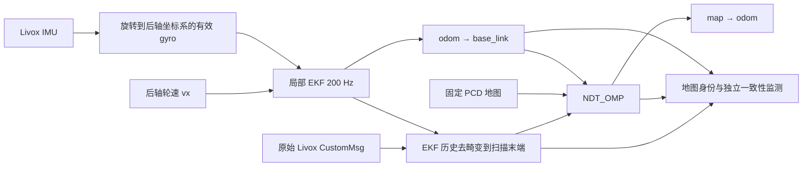

# 轮速/IMU EKF + 已知地图 NDT

这是独立的实验定位入口。它接收原始 Livox、IMU 和后轴轮速，在保存的 PCD
地图上定位；验收结果见 [桌面回放报告](../reports/2026-10-05-wheel-imu-ndt.md)。
当前阶段只验证桌面原速回放，车辆部署需要另做 Orin 实测。



局部 EKF 只融合轮速 `vx` 和陀螺仪 `wz`。它不融合 NDT 位姿，NDT 也不
向 EKF 回灌状态。全局位姿由 `T_map_odom × T_odom_base` 得到。200 Hz 是
EKF 的预测/融合输出频率；新的地图观测频率受 10 Hz 雷达及配准耗时限制。

## 接口与时间语义

| 接口 | 语义 |
| --- | --- |
| `/livox/lidar` | `livox_ros_driver2/CustomMsg`，`livox_frame`，首点时间戳 + 每点纳秒 offset |
| `/livox/imu` | 原始 IMU，转换节点验证 frame 和有限值 |
| `/rear_axle/wheel_odom` | `odom/base_link` 后轴轮速；仅使用 twist.linear.x |
| `/rear_axle/imu` | 真实旋转后的角速度及协方差；gyro_only 模式将姿态/加速度标为不可用 |
| `/odometry/filtered` | 局部 `odom/base_link`，目标 200 Hz |
| `/localization/deskewed_cloud` | 已去畸变的 `livox_frame` 点云，时间戳为扫描末端 |
| `/localization/ndt_pose` | 上游全局位姿接口，可能包含持有锚点的桥接输出，不能单靠发布频率判断新观测 |
| `/localization/ndt_status` | 上游扫描配准诊断 |
| `/localization/map_sha256` | transient_local 的原始 PCD 文件 SHA256 |
| `/localization/status` | 输入年龄、可信观测年龄、状态、独立 inlier fraction 及纠正累计量 |
| `/localization/map_valid` | 只有连续 3 次可信扫描且输入/观测新鲜时为 true |
| `/localization/deskew_status` | 接收/输出/丢帧、队列与阶段耗时、源时间年龄 |

去畸变工作线程的待处理队列上限为 2，满时丢最旧扫描。完整扫描必须有
EKF 历史覆盖，相邻姿态间隔默认不得超过 20 ms；最多等待 100 ms，失败就
丢弃，避免把未去畸变点云当成有效输出。姿态历史为 2 s。旋转使用 Slerp，
平移线性插值，完整包含 `base_link→livox_frame` 外参。模拟时钟倒退会清空旧
历史及进行中的结果。

NDT 使用原生 `map→odom` 和外部 `odom→base_link` 预测。内部 IMU、预积分、
二次 deskew、twist 积分均关闭。纠正使用固定 fitness、平移/yaw 和全旋转角
门限；拒绝后保留可信锚点，不自动放松纠正门限或重初始化。参数文件是
[ndt_wheel_imu.yaml](../../src/aims_racer_system/params/ndt_wheel_imu.yaml)。

健康状态按可信扫描源时间计算：至少 0.5 s 未更新为 degraded，超过 2 s 或
缺少有效输入为 lost。桥接位姿、定时器 TF、重复诊断不会刷新观测年龄。
监测核对扫描诊断、扫描位姿、源时刻 EKF 和同纳秒时间戳最新到达的 TF 包。
这样绕开 Humble TF2 对“旧锚点/新锚点同时间戳、且已有较新 timer TF”的
查询歧义。独立质量检查只诊断，使用源时间上的持有纠正，不广播 TF，不改变
EKF/NDT，也不代表外部定位真值。

## 固定桌面回放环境

依赖及唯一上游诊断补丁记录在
[dependencies.yaml](../../src/aims_racer_system/replay/dependencies.yaml)。补丁只
增加完整纠正旋转角的诊断字段，用于辨别锚点门限，不改变配准/接受逻辑。
脚本检查固定 HEAD 和完整 `git diff HEAD`，仅允许该补丁。

```bash
cd /home/elesheep/AIMSRacer-ndt
bash src/aims_racer_system/scripts/ndt_replay_environment.sh \
  "$PWD/log/wheel-imu-ndt" /home/elesheep/AIMSRacerBag
```

脚本生成独立 Humble/PCL 镜像，固定依赖到忽略目录，以消息子集构建 Livox
接口，避免回放时引入硬件驱动。它不会替换已有同名容器；已有本次环境时用
`docker start aimsracer-ndt-replay`。另建环境可指定 `NDT_REPLAY_CONTAINER`。
`ROS_DOMAIN_ID` 只作用于该回放图；所有参与节点需要在同一个独立 DDS 域。

单 bag 示例：

```bash
docker exec aimsracer-ndt-replay bash -lc '
  source /opt/ros/humble/setup.bash
  source /ws/install/setup.bash
  python3 /repo/src/aims_racer_system/scripts/ndt_replay.py \
    --bag /bags/venue-20261003-161459-bag \
    --map /bags/maps/20260928_010503/map.pcd \
    --output /repo/log/wheel-imu-ndt/manual-A-1
'
```

输出目录必须新建或为空。每次重启整个定位图。输入只播放原始雷达、IMU
及测得轮速，保持 1 倍速。模拟时钟用 1000 Hz，避免 `/clock=200Hz` 与
200 Hz EKF 定时器的粒度干涉；不能把慢速回放结果当成原速算力证据。

A 使用历史 `map→odom × 后轴 LIO` 计算一次 map/base_link 初值，之后历史
TF、LIO 和 EKF 不进入实时图。B 没有地图 TF/hash，因此先对首段静止扫描
执行一次离线 BBS + NDT 初值搜索，并保存候选和地图一致性证据：

```bash
docker exec aimsracer-ndt-replay bash -lc '
  source /opt/ros/humble/setup.bash
  source /ws/install/setup.bash
  python3 /repo/src/aims_racer_system/scripts/ndt_initial_seed.py \
    --bag /bags/mpcc-test-20261003-013910 \
    --map /bags/maps/20260928_010503/map.pcd \
    --geometry /repo/src/aims_racer_system/params/rear_axle_geometry.yaml \
    --output /repo/log/wheel-imu-ndt/manual-B-seed
'
```

将生成的 `initial_pose.json` 用 `--initial-pose` 传入回放。它是固定初始化
假设，不是持续状态输入或自动恢复策略；B 没有历史 map hash，一致性不能
替代独立地图身份/真值证明。没有可靠候选或有近分数的远处歧义时不输出 seed。
D 不含测得轮速，只允许 `--local-only --zero-wheel` 静止适配测试。

完整测试使用 `ndt_replay_suite.py --map ... --output ... --b-seed ...`，顺序
执行 D、A/B 各 3 次、A/B 局部链路对照、A 的 0.2/0.5/1 s LiDAR 丢帧与
NDT 进程暂停。暂停只作用于该次 launch 的 NDT 子进程，恢复后才判断新扫描
何时实际到达；暂停整个进程包含其回调和定时器，不能解释为仅算法核心暂停。
`ndt_replay_report.py --suite ... --output ...` 生成 CSV/JSON/PNG 与旧输出对照。
C 长包按用户要求取消测试，其已中止片段不作为验收。套件只含上述 15 项，
没有后续 C 回放安排。后续实车启动与静止观察当前不安排、不执行。

标准测试：

```bash
docker exec aimsracer-ndt-replay bash -lc '
  source /opt/ros/humble/setup.bash
  source /ws/install/setup.bash
  cd /ws
  colcon test --base-paths /repo/src/aims_racer_system \
    --packages-select aims_racer_system
  colcon test-result --verbose
'
```

## 独立启动与初始化

在能提供上述原始输入的 ROS 图中启动：

```bash
ros2 launch aims_racer_system wheel_imu_ndt_localization.launch.py \
  map_file:=/absolute/path/map.pcd use_sim_time:=false
```

该入口启动静态外参、gyro 适配器、局部 EKF、去畸变、NDT 生命周期及监测。
初始化使用 `/initialpose`，语义是 **后轴 base_link 在 map 中的位姿**，可以
通过 RViz 的 2D Pose Estimate 提供。等待 `/localization/map_valid=true`，
同时检查匹配质量与观测年龄。车辆硬件输入、轮速标定、外参、静止陀螺仪偏置
及 Orin 最坏延迟需要实测；目前不自动启动控制器。
