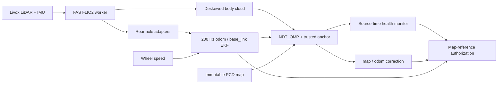

# FAST-LIO2 + NDT integration validation

## Scope and source

This branch is based on MPCC `ed2b14e`, preserving its updated FAST-LIO2,
rear axle adapters, wheel/IMU fusion and 200 Hz EKF. It ports NDT selectively;
the older standalone wheel/IMU + NDT branch is not merged.

| Component | Exact source |
| --- | --- |
| AIMSRacer branch | `feat/fastlio-ndt-mpcc` |
| Integration implementation | `7bf1b23`, final runtime refinement `7da530e` |
| Replay initialization/lifecycle audit | `55241ea` and subsequent audit refinements |
| Final delivery/confirmation audit | `bee9f25` |
| FAST-LIO2 | `30bc305b4240369879c346398ac6e0a1ea5ed420` |
| lidar_localization_ros2 | `5f795a6cd886a20ade4175cb70bde630ac9ec785` + recorded trusted-anchor patch |
| ndt_omp_ros2 | `63bf15b965b71d3a53db1757abe8e31b6114372a` + recorded line-search patch |
| PCD SHA-256 | `1db8c1905dc99ed4c0897838421118b998d15eb7cf57f50cee96a8b0744870dc` |

Bootstrap verifies dependency HEADs, patch SHA-256 and the complete source delta.
It refuses unrelated modifications. External dependency trees and bags remain
outside the tracked source. Unified-diff context whitespace is preserved.

## New contract



NDT registration uses two OpenMP threads; its ROS executor has three threads
with separate callback groups. Registration releases the shared state lock during
both solving and fitness/Hessian evaluation, while retaining backend exclusion.
Crop preparation still holds the state lock; callback latency is measured separately.
FAST-LIO keeps the MPCC
branch's receiver/worker separation and bounded input buffer.

NDT uses same-scan EKF TF as prediction, with no additional deskew or NDT IMU
fusion. Initialization is explicitly **base_link in map**, privately confirms
three consistent candidates, then commits the first anchor. Tracking admission
is one native decision: convergence, finite values, fitness, correction size,
source age, TF availability and initialization generation. Rejection cannot
modify prediction or the trusted map/odom anchor. Timer TF at 50 Hz renews only
the transport timestamp.

Monitor health expires after 0.5 s without a committed anchor; EKF freshness is
0.1 s and cloud freshness 0.5 s, including monotonic receive watchdogs. Recovery
requires three new commits. Ordered health packets and epochs prevent old ready
messages overriding later loss. MPCC faults, cancels plans and requests zero
speed on lost/expired health; recovery requires manual enable. Independent
scan/map inlier fraction is diagnostic and does not authorize navigation.

## Build and regression evidence

Desktop container: `aimsracer-fastlio-ndt-integration`, Humble, domain 194,
localhost only. Desktop FAST-LIO executable is the independently built matching
`30bc305` binary. NDT was completely cleaned and rebuilt after the class-layout changes. The final
two implementation files were rebuilt after the scoring-lock/timing refinement;
headers and class layout were unchanged. Activation and timing output confirm
that the final native binary is used.

- aims_racer_system: 33 CTest/Python cases passed.
- Controller: 8 tests passed, including real ROS diagnostic message adapter,
  plan cancellation, zero-speed state and manual restart contract.
- NDT_OMP: 6 cases passed, including two numerical line-search regressions.
- Native anchor admission and generation-commit exclusion executables passed.
- Source specification and source quality reviews passed separately.

The prior rear-axle test imported a removed Python implementation. Its gravity
and lever-arm covariance case now tests the production C++ implementation;
production IMU behavior was not changed.

## Desktop replay evidence

Replay feeds only `/livox/lidar`, `/livox/imu`, `/rear_axle/wheel_odom`, plus
simulated clock at 1x. Recorded TF, LIO, EKF, localization and commands are
excluded. Offline initial seeds have explicit provenance; they are not external
ground truth. The audit captures publisher GIDs through C++ MessageInfo.

Artifacts are under `/home/elesheep/AIMSRacer-fastlio-ndt/log/fastlio-ndt/`.
Each valid run has `summary.json`, `events.jsonl`, `tf-authorities.jsonl`,
`fastlio-trace.csv`, and `acceptance.json` after evaluation.

| Run | Outcome |
| --- | --- |
| `A-desktop-verified` | Preliminary full chain: 464 commits, accepted NDT P95 29.83 ms; initial independent diagnostic unavailable, so not final acceptance. |
| `A-desktop-installed-final` | Installed scripts/parameters match source hashes; continuous tracking and installed initializer CLI passed. 458 commits, accepted NDT P95 28.29 ms, max 37.84 ms. 92 independent diagnostic samples, median 99.78%. |
| `A-desktop-fault` | Historical fault audit passed on the same health core, with older installed monitor/static TF QoS; not a final-monitor rerun. NDT paused 0.7 s: ready revoked after 0.412 s; exactly three new commits before recovery. One publisher per dynamic TF edge. Independent inlier median 99.71%. |
| `A-desktop-lifecycle-isolated` | Historical lifecycle audit with older installed monitor/static TF QoS, same health core. Installed initializer CLI succeeded. Lifecycle deactivate revoked trust; no commits or map/odom TF after deactivate. All audit checks passed. |
| `D-desktop-isolated` | Local-only graph passed: 297 body clouds, 5,950 EKF messages, one odom/base_link owner. No matching prior map is claimed for D. |
| `B-desktop-verified` | Tracking acceptance failed: 302 commits, later rotation/translation/fitness rejection and loss. |

### Final source (`7da530e`)

| Desktop run | Result | Accepted alignment P95 | Full processing P95 | TF map/odom receive gap max |
| --- | --- | ---: | ---: | ---: |
| `A-desktop-processing-final` | All nine checks passed; 451 commits, installed initializer success, no tracking loss | 28.89 ms | 33.41 ms | 20.79 ms |
| `B-desktop-processing-final` | Continuous tracking failed; other seven checks passed; 304 commits | 32.47 ms | 229.75 ms | 85.27 ms |

`A-desktop-processing-fault` passed all ten checks on the final binary: a 0.7 s
NDT process pause revoked ready after 0.426 s, then exactly three consecutive
native commits restored readiness. The expected TF pause was 720 ms;
odom/base_link remained continuous (maximum receive gap 10.37 ms).

A received all 478 LiDAR scans and 9,539 IMU packets; FAST-LIO produced 475
clouds after startup. Core P95 was 11.07 ms, receipt-to-output P95 11.32 ms,
with no pending scans at trace checkpoints and zero dropped trace records.
There were 91 independent quality samples, median 99.77%.

B received all 714 scans and 14,285 IMU packets; FAST-LIO produced 712 clouds.
Core P95 was 15.16 ms, receipt-to-output P95 15.35 ms. All attempted NDT
alignment P95 was 33.68 ms, while full processing P95 was 229.75 ms;
registration fitness/preparation overhead is material when scan/map consistency
is poor. There were 67 rotation, 16 translation and 187 fitness rejections;
141 independent samples had median 24.41%. Accepted-only timings do not
characterize the rejected part of this run. Source-time guards remain enabled.

Historical timing below belongs to the earlier runs, not the final binary:

A fault-run accepted NDT P95 was 30.58 ms, max 40.95 ms. All attempted
registrations, including interrupted/rejected attempts, had P95 30.61 ms and
max 206.45 ms. Reported alignment time is not total source age. FAST-LIO core
P95 was 9.96 ms; scan receipt to output P95 10.23 ms. Trace sampling showed no
queued scan at the recorded checkpoints and zero dropped trace records; this
is not a general overload guarantee.

B has unconfirmed map identity and documented wheel/motion inconsistencies;
manual translation/tilt is outside normal planar wheel-observed driving. This run
does not establish a single root cause or a compute-capacity failure. Its
thresholds were not relaxed. Successful anchor commits do not prove pose
accuracy, and B is not a successful driving acceptance dataset.

Preliminary failed runs are retained separately. Initial incrementally built
NDT crashed before registration; the same source passed after complete clean
rebuild. Python Humble lacks publisher GID metadata, so the audit moved to C++.
A local-only empty launch argument was fixed. A copied monitor script also
remained older than source; the system package was cleaned/reinstalled and its
SHA-256 checked. The harness now refuses mismatched installed scripts/parameters.
The final monitor uses transient-local depth 100 to retain both static TF
publishers, with explicit missing-input diagnostics. An accidentally overlapping pair
of replays was stopped and excluded; a per-domain lock now rejects concurrent
harness runs before graph creation. The final isolated runs supersede them.

## NX deployment and acceptance

NX source is isolated at `/home/aims/AIMSRacer-fastlio-ndt`. Its original
`/home/aims/AIMSRacer` remains on the MPCC branch with its local changes
preserved. Dependency sources, build, install and logs are under the new
worktree's `log/fastlio-ndt`. Source delivery is local git push, NX fetch/pull;
seed fixtures are copied as data. Dependency updates are generated from the
recorded patches and verified by the bootstrap against the complete source delta.

NX build initially let colcon override `CMAKE_BUILD_PARALLEL_LEVEL=2` with
`-j8`, exhausting available RAM/swap. That owned build was stopped and NDT
cleaned. The corrected build uses explicit `MAKEFLAGS="-j2 -l2"` and sequential
package execution. This compiler setting is separate from NDT's two registration
threads and three ROS executor threads. Power mode is `MAXN_SUPER`, CPU governor `schedutil`; neither was changed.

The initial full NX build completed all five packages in 18 min 5 s. The final
native two-file rebuild completed in 2 min 23 s. Final system cases: 33 passed;
controller health/ROS adapter: seven passed. Native admission and generation
exclusion executables passed on arm64. Four additional replay-audit regression
cases cover failed-player acceptance, explicit partial runs, initial monitor
confirmation and subsequent tracking loss. They pass on desktop and arm64.

Replay initially referenced historical bag paths, which now resolve under
`/home/aims/aimsracer-data/sessions/2026-10-03/`; those failed preflights are
retained. A sequential reused-domain run also missed the first two D scans,
then a subsequent A fault run lost 13 IMU samples before the pause injection.
FAST-LIO exited on the resulting 74 ms gap; raw bag source gaps are at most
18.74 ms and contain those missing samples. The monitor stayed unready.
That run does not test NDT recovery. The precise transport-loss cause is not
established. Fresh isolated domains and five seconds of DDS discovery are used
for the later audits; full runs now require successful player completion and
exact raw LiDAR/IMU receipt counts. Explicit shortened lifecycle runs are
labelled partial, and cannot claim full-bag delivery.

| NX run | Result | Key timing |
| --- | --- | --- |
| `A-NX-final` | Nine checks passed; 447 commits, installed initializer passed, no tracking loss | Accepted alignment P95 51.92 ms; processing P95 58.26 ms; map/odom gap max 23.51 ms |
| `D-NX-delivery-final` | Full raw delivery: 300 scans / 6,001 IMUs; 297 output clouds, 5,966 EKF outputs, one odom/base_link owner | FAST-LIO core P95 21.86 ms; receipt-to-output P95 22.33 ms |
| `A-NX-fault-isolated` | All 12 checks passed; 0.7 s NDT pause, loss after 0.388 s, exactly three commits before recovery; complete raw delivery | Accepted alignment P95 51.90 ms; processing P95 58.42 ms; odom/base_link gap max 13.89 ms |
| `A-NX-lifecycle-final` | All 13 checks passed in explicitly partial run; inactive revokes native trust, no later commits or map/odom TF, installed initializer passed | Localization revoked about 2.5 ms after service request; local odometry continued |
| `B-NX-final` | Continuous tracking failed; all other checks passed, including complete raw delivery; 278 commits | Accepted alignment P95 68.88 ms; all attempts P95 90.43 ms; full processing P95 217.61 ms |

A's full raw receipt was 478 scans / 9,539 IMUs, with 475 output clouds.
FAST-LIO core P95 was 27.30 ms, receipt-to-output P95 27.90 ms. No pending
scan was observed at the trace checkpoints and no trace record was dropped.
Independent consistency had 91 samples, median 99.71%. One cold startup
attempt took 705.57 ms overall (591.32 ms alignment), was rejected as stale,
and did not commit an anchor. After confirmation, committed source age P95
was 163.43 ms; accepted alignment max was 83.89 ms. The map/odom and
odom/base_link edges each had one publisher. B received all 714 scans / 14,285 IMUs, and produced 712 clouds. FAST-LIO
core P95 was 37.05 ms (max 78.45 ms), receipt-to-output P95 37.60 ms;
no pending scan was observed and no trace record was dropped. Native rejection
counts were 71 rotation, 95 translation, 132 fitness and six stale attempts.
Independent inlier median was 29.49% across 139 samples. Map/odom receive gap
max was 125.43 ms (P95 20.11 ms), while odom/base_link max was 17.24 ms.
Scoring no longer holds the shared state lock, but crop/target preparation can
still stall TF callbacks. This replay is a retained localization failure,
not evidence of successful long-term tracking or an isolated FAST-LIO timeout.

`A-NX-audited-final` repeats the normal A chain with full player/delivery
metadata: 435 commits, alignment P95 53.84 ms (max 85.94 ms), full processing
P95 61.87 ms (cold maximum 686.01 ms rejected). FAST-LIO core P95 was
25.86 ms and receipt-to-output P95 26.42 ms. All 478 scans / 9,539 IMUs
arrived; 475 body clouds were published. Both dynamic TF edges had one owner;
map/odom max receive gap was 23.77 ms. Independent inlier median was 99.71%
across 88 samples. All 12 final audit checks passed.

Its first audit incorrectly counted one initialization heartbeat as a tracking
loss: the native event reached the audit first, then the monitor's older
anchor-sequence-0 heartbeat arrived 1.43 ms later, followed by ready confirmation
0.79 ms after that. Continuous tracking now starts at the monitor's explicit
same-epoch confirmation covering the first native commit. Confirmation itself
is mandatory; all subsequent loss still fails. Regression fixtures prove both
boundaries. The production watchdog and admission thresholds were unchanged.

During the isolated NX suite, observed CPU clocks were 1,984 MHz and CPU
sensor temperature ranged 57.94–62.13 C. Peak reported total RAM was 3,147 MiB.
These are replay observations, without the live driver/control workload.

Independent consistency queries now use a 0.25 m search bound, preserving the
same inlier fraction and inlier-only RMSE, including the exact 0.25 m boundary.
An extreme synthetic far-scan workload (2,000 queries against 990,482 map points)
took median 3,027 ms without the bound and 0.173 ms with it, both reporting zero
inliers. This is a query benchmark, not a measured B replay speedup.

Native `alignment_time_sec` measures the entire PCL `align()` call, including
any lazy target search-tree build; it is not an isolated NDT iteration/kernel
measurement. Full processing additionally includes scan preparation, target
setup and fitness evaluation. Timing messages do not renew trust.

## Run and rollback

For deployment, open a fresh Bash terminal and source the new installation:

```bash
source /home/aims/AIMSRacer-fastlio-ndt/log/fastlio-ndt/install/setup.bash
ros2 launch aims_racer_system base_orin_livox_bringup_v2.launch.py
# In another terminal with the same overlay and ROS domain:
ros2 launch aims_racer_system known_map_localization.launch.py \
  map_file:=/home/aims/maps/20260928_010503/map.pcd
ros2 run aims_racer_system relocalize_known_map.py \
  /home/aims/maps/20260928_010503/map.pcd --pose-frame base_link \
  --x <measured-x> --y <measured-y> --yaw <measured-yaw>
```

See [operation instructions](../operations/known-map-mpcc.md) for complete
frame, map identity, initialization and MPCC health requirements. Existing
prepared references/data remain in the original workspace. For rollback stop
the new graph and open a fresh terminal using the old workspace/validated old
overlay. Do not run both localization owners together.

No actuator nodes or drive-command publishers are launched by the replay.
Build, regression and replay acceptance do not establish physical localization
accuracy, multi-lap reliability, braking performance or real-car closed-loop
MPCC acceptance. Those remain separate vehicle checks.
