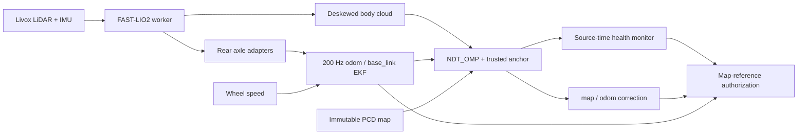

# FAST-LIO2 + NDT integration validation

## Scope and source

This branch is based on MPCC `ed2b14e`, preserving its updated FAST-LIO2,
rear axle adapters, wheel/IMU fusion and 200 Hz EKF. It ports NDT selectively;
the older standalone wheel/IMU + NDT branch is not merged.

| Component | Exact source |
| --- | --- |
| AIMSRacer branch | `feat/fastlio-ndt-mpcc` |
| Integration implementation | `7bf1b23` |
| Replay initialization/lifecycle audit | `55241ea` and subsequent audit refinements |
| FAST-LIO2 | `30bc305b4240369879c346398ac6e0a1ea5ed420` |
| lidar_localization_ros2 | `5f795a6cd886a20ade4175cb70bde630ac9ec785` + recorded trusted-anchor patch |
| ndt_omp_ros2 | `63bf15b965b71d3a53db1757abe8e31b6114372a` + recorded line-search patch |
| PCD SHA-256 | `1db8c1905dc99ed4c0897838421118b998d15eb7cf57f50cee96a8b0744870dc` |

Bootstrap verifies dependency HEADs, patch SHA-256 and the complete source delta.
It refuses unrelated modifications. External dependency trees and bags remain
outside the tracked source. Unified-diff context whitespace is preserved.

## New contract



NDT registration uses two OpenMP threads; its ROS executor has three threads
with separate callback groups. Registration releases the shared state lock during
both solving and fitness/Hessian evaluation, while retaining backend exclusion.
Crop preparation still holds the state lock; callback latency is measured separately.
FAST-LIO keeps the MPCC
branch's receiver/worker separation and bounded input buffer.

NDT uses same-scan EKF TF as prediction, with no additional deskew or NDT IMU
fusion. Initialization is explicitly **base_link in map**, privately confirms
three consistent candidates, then commits the first anchor. Tracking admission
is one native decision: convergence, finite values, fitness, correction size,
source age, TF availability and initialization generation. Rejection cannot
modify prediction or the trusted map/odom anchor. Timer TF at 50 Hz renews only
the transport timestamp.

Monitor health expires after 0.5 s without a committed anchor; EKF freshness is
0.1 s and cloud freshness 0.5 s, including monotonic receive watchdogs. Recovery
requires three new commits. Ordered health packets and epochs prevent old ready
messages overriding later loss. MPCC faults, cancels plans and requests zero
speed on lost/expired health; recovery requires manual enable. Independent
scan/map inlier fraction is diagnostic and does not authorize navigation.

## Build and regression evidence

Desktop container: `aimsracer-fastlio-ndt-integration`, Humble, domain 194,
localhost only. Desktop FAST-LIO executable is the independently built matching
`30bc305` binary. NDT was completely cleaned and rebuilt after source freeze.
The final fresh binary configured and activated successfully.

- aims_racer_system: 33 CTest/Python cases passed.
- Controller: 8 tests passed, including real ROS diagnostic message adapter,
  plan cancellation, zero-speed state and manual restart contract.
- NDT_OMP: 6 cases passed, including two numerical line-search regressions.
- Native anchor admission and generation-commit exclusion executables passed.
- Source specification and source quality reviews passed separately.

The prior rear-axle test imported a removed Python implementation. Its gravity
and lever-arm covariance case now tests the production C++ implementation;
production IMU behavior was not changed.

## Desktop replay evidence

Replay feeds only `/livox/lidar`, `/livox/imu`, `/rear_axle/wheel_odom`, plus
simulated clock at 1x. Recorded TF, LIO, EKF, localization and commands are
excluded. Offline initial seeds have explicit provenance; they are not external
ground truth. The audit captures publisher GIDs through C++ MessageInfo.

Artifacts are under `/home/elesheep/AIMSRacer-fastlio-ndt/log/fastlio-ndt/`.
Each valid run has `summary.json`, `events.jsonl`, `tf-authorities.jsonl`,
`fastlio-trace.csv`, and `acceptance.json` after evaluation.

| Run | Outcome |
| --- | --- |
| `A-desktop-verified` | Preliminary full chain: 464 commits, accepted NDT P95 29.83 ms; initial independent diagnostic unavailable, so not final acceptance. |
| `A-desktop-installed-final` | Installed scripts/parameters match source hashes; continuous tracking and installed initializer CLI passed. 458 commits, accepted NDT P95 28.29 ms, max 37.84 ms. 92 independent diagnostic samples, median 99.78%. |
| `A-desktop-fault` | Historical fault audit passed on the same health core, with older installed monitor/static TF QoS; not a final-monitor rerun. NDT paused 0.7 s: ready revoked after 0.412 s; exactly three new commits before recovery. One publisher per dynamic TF edge. Independent inlier median 99.71%. |
| `A-desktop-lifecycle-isolated` | Historical lifecycle audit with older installed monitor/static TF QoS, same health core. Installed initializer CLI succeeded. Lifecycle deactivate revoked trust; no commits or map/odom TF after deactivate. All audit checks passed. |
| `D-desktop-isolated` | Local-only graph passed: 297 body clouds, 5,950 EKF messages, one odom/base_link owner. No matching prior map is claimed for D. |
| `B-desktop-verified` | Tracking acceptance failed: 302 commits, later rotation/translation/fitness rejection and loss. |

A fault-run accepted NDT P95 was 30.58 ms, max 40.95 ms. All attempted
registrations, including interrupted/rejected attempts, had P95 30.61 ms and
max 206.45 ms. Reported alignment time is not total source age. FAST-LIO core
P95 was 9.96 ms; scan receipt to output P95 10.23 ms. Trace sampling showed no
queued scan at the recorded checkpoints and zero dropped trace records; this
is not a general overload guarantee.

B has unconfirmed map identity and documented wheel/motion inconsistencies;
manual translation/tilt is outside normal planar wheel-observed driving. This run
does not establish a single root cause or a compute-capacity failure. Its
thresholds were not relaxed. Successful anchor commits do not prove pose
accuracy, and B is not a successful driving acceptance dataset.

Preliminary failed runs are retained separately. Initial incrementally built
NDT crashed before registration; the same source passed after complete clean
rebuild. Python Humble lacks publisher GID metadata, so the audit moved to C++.
A local-only empty launch argument was fixed. A copied monitor script also
remained older than source; the system package was cleaned/reinstalled and its
SHA-256 checked. The harness now refuses mismatched installed scripts/parameters.
The final monitor uses transient-local depth 100 to retain both static TF
publishers, with explicit missing-input diagnostics. An accidentally overlapping pair
of replays was stopped and excluded; a per-domain lock now rejects concurrent
harness runs before graph creation. The final isolated runs supersede them.

## NX deployment and acceptance

NX source is isolated at `/home/aims/AIMSRacer-fastlio-ndt`. Its original
`/home/aims/AIMSRacer` remains on the MPCC branch with its local changes
preserved. Dependency sources, build, install and logs are under the new
worktree's `log/fastlio-ndt`. Source delivery is local git push, NX fetch/pull;
only seed fixtures are copied as data.

NX build initially let colcon override `CMAKE_BUILD_PARALLEL_LEVEL=2` with
`-j8`, exhausting available RAM/swap. That owned build was stopped and NDT
cleaned. The corrected build uses explicit `MAKEFLAGS="-j2 -l2"` and sequential
package execution. This compiler setting is separate from NDT's two registration
threads and three ROS executor threads. Power mode is `MAXN_SUPER`, CPU governor `schedutil`; neither was changed.

The initial full NX build completed all five packages in 18 min 5 s; 32 system
cases and seven controller cases passed before the final diagnostic/native-lock
refinement. Final-source build and replay results are recorded below after execution.

Independent consistency queries now use a 0.25 m search bound, preserving the
same inlier fraction and inlier-only RMSE, including the exact 0.25 m boundary.
An extreme synthetic far-scan workload (2,000 queries against 990,482 map points)
took median 3,027 ms without the bound and 0.173 ms with it, both reporting zero
inliers. This is a query benchmark, not a measured B replay speedup.

Native timing distinguishes the alignment kernel from scan preparation, crop,
alignment and fitness evaluation together. Timing messages do not renew trust.

## Run and rollback

For deployment, open a fresh Bash terminal and source the new installation:

```bash
source /home/aims/AIMSRacer-fastlio-ndt/log/fastlio-ndt/install/setup.bash
ros2 launch aims_racer_system base_orin_livox_bringup_v2.launch.py
# In another terminal with the same overlay and ROS domain:
ros2 launch aims_racer_system known_map_localization.launch.py \
  map_file:=/home/aims/maps/20260928_010503/map.pcd
ros2 run aims_racer_system relocalize_known_map.py \
  /home/aims/maps/20260928_010503/map.pcd --pose-frame base_link \
  --x <measured-x> --y <measured-y> --yaw <measured-yaw>
```

See [operation instructions](../operations/known-map-mpcc.md) for complete
frame, map identity, initialization and MPCC health requirements. Existing
prepared references/data remain in the original workspace. For rollback stop
the new graph and open a fresh terminal using the old workspace/validated old
overlay. Do not run both localization owners together.

No actuator nodes or drive-command publishers are launched by the replay.
Build, regression and replay acceptance do not establish physical localization
accuracy, multi-lap reliability, braking performance or real-car closed-loop
MPCC acceptance. Those remain separate vehicle checks.
