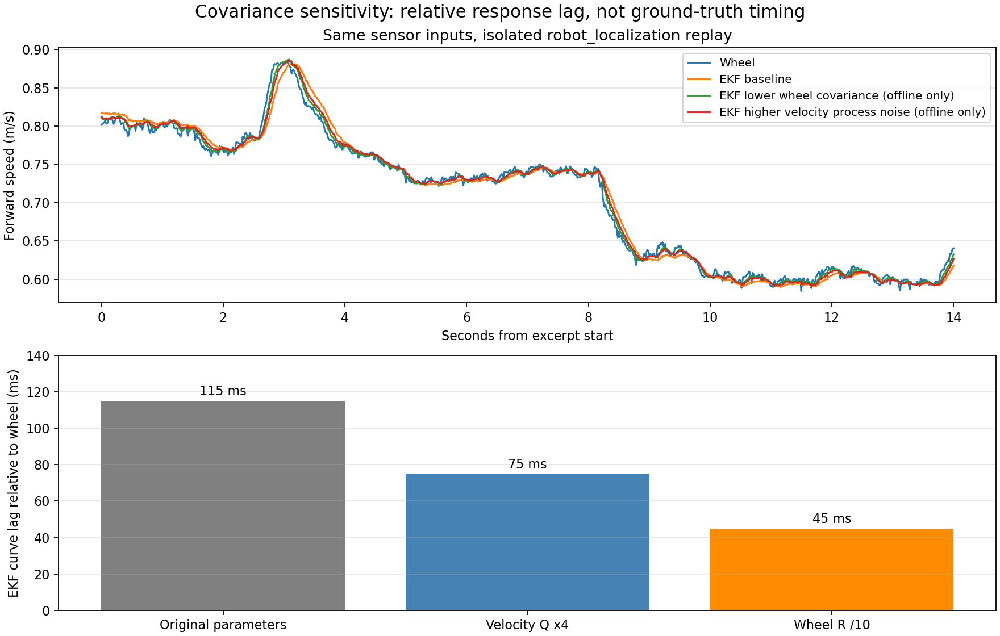

# 2026-10-05 实车摆动诊断：时序、模型与权重

## 数据与边界

分析使用已停止写入并恢复 metadata 的 bag：约 50 秒遥控一圈窗口，以及首次 1.0 m/s 巡航自动尝试的 10.48 秒窗口。完成的 0.5 m/s 自动一圈只有控制器日志和独立观察记录，没有同期完整传感器 bag，不把它用于本报告的多传感器相位比较。

本轮没有修改实车配置、受版本控制的代码或任何 submodule。硬件状态最后确认是 manual、锁车、静止，MPCC 已停止。所有新文件均为本次 session 的本地诊断材料。

## 三种时间量必须区分

1. 消息年龄：bag 接收时间减 header.stamp，包含发布、计算与传输等环节。
2. 相对响应滞后：按各自 header.stamp 对齐后，两条动态曲线达到最佳拟合所需的时间偏移。
3. 相对真实运动的绝对滞后：需要独立运动真值；本次没有动捕或物理转角反馈，无法直接测得。

速度相位拟合使用 v_EKF(t) ≈ a × v_wheel(t−Δ) + b，扫描时间偏移，并在每个偏移上拟合尺度和常数偏置。正 Δ 表示 EKF 变化较晚。偏移步长 5 ms；这些值是窗口内的等效相位偏移，不代表固定纯延时。

## 输入输出链路

| 量 | 首次自动窗口结果 | 解释 |
|---|---:|---|
| 原始 LIO 消息年龄 P50 / P95 / 最大 | 69.4 / 111.2 / 184.9 ms | LIO 计算及发布年龄 |
| 后轴 LIO 消息年龄 P50 / P95 / 最大 | 74.8 / 117.6 / 187.9 ms | 增加后轴转换及调度 |
| EKF 消息年龄 P50 / P95 / 最大 | 0.54 / 2.90 / 13.53 ms | EKF 消息没有 100 ms 的接收积压 |
| MPCC 提议到实际选择命令 P50 / P95 / 最大 | 2.55 / 7.11 / 12.48 ms | 520 条匹配命令，未发现缺失 |
| 选择命令到 servo 指令 P50 / P95 / 最大 | 0.21 / 1.79 / 12.27 ms | 指令链路，不是物理舵机响应 |
| 相邻 map→odom 修正的最大平移 / yaw | 1.81 cm / 0.33° | 未发现单次大幅地图变换跳变 |

VESC 转换代码直接使用 ERPM / gain（3465），没有额外 ROS 速度低通。驱动约每 20 ms 查询，header.stamp 在数据包接收解码时填写，不是硬件采样时刻。因此不能从本 bag 排除内部 ERPM 估计、串口及查询造成的原始轮速延迟；以前约 50 ms 的指令到首次 ERPM 响应也不等同于纯传输时间。

## EKF 的不同状态量

| 状态量 | 遥控窗口 | 自动窗口 | 对照方法 |
|---|---:|---:|---|
| 前向速度相对轮速的最佳滞后 | 115 ms | 105 ms | 按源时间进行速度曲线拟合 |
| twist.angular.z 相对原始 IMU 的最佳滞后 | 40 ms | 45 ms | 按源时间进行横摆角速度曲线拟合 |
| pose yaw 变化的最佳对齐偏移 | +5 ms | −5 ms | yaw 解包后用居中的 105 ms Savitzky–Golay 导数，与原始 IMU 比较 |

pose yaw 的结果接近零，未发现明显几十毫秒级的额外滞后；±5 ms 不是精确的绝对时延保证。姿态与原始 IMU 也不是独立真值。当前 MPCC 使用 pose yaw 和前向速度，不把 EKF twist.angular.z 作为状态输入。各状态量通过模型与测量的更新路径不同，不能将角速度的相位偏移直接套到 yaw 上。

速度分段分析得到约 105–135 ms，说明不是只由一个孤立样本引起。自动窗口移位前后拟合 RMS 从 0.0332 降至 0.0143 m/s；遥控窗口从 0.0198 降至 0.0087 m/s。相对轮速的滞后不证明轮速本身是真实速度。

## 隔离回放：滤波配置能改变响应

使用 ROS_DOMAIN_ID=94、ROS_LOCALHOST_ONLY=1 的隔离回放，仅播放后轴 wheel/LIO/IMU 和静态 TF；没有 drive、RC、motor 或 servo 指令话题。三个 robot_localization 实例关闭 TF 发布，共用原始输入。实验结束后回放和实验节点均已退出。

| 回放配置 | EKF 相对轮速的最佳滞后 | 10 ms 速度增量 RMS |
|---|---:|---:|
| 原配置 | 115 ms | 0.00179 m/s |
| 仅速度过程噪声 Q ×4 | 75 ms | 0.00199 m/s |
| 仅轮速测量方差 R：0.04 → 0.004 | 45 ms | 0.00219 m/s |

原配置回放与原实车 EKF 速度的 RMS 差仅 0.000716 m/s，复现度较好。原配置 vx 的过程噪声项为 0.025，轮速测量方差为 0.04；IMU 只融合 yaw rate，不融合前向加速度。

对照支持当前融合配置产生额外响应滞后的解释，而不是 EKF 发布消息晚了 100 ms。更快的配置有稍大的短时速度变化；增量 RMS 不是有真值支持的噪声估计，贴近轮速也不等于真实运动估计更准确。上述两种改动仅用于隔离实验，未应用到实车。

## 预测与模型检查

预测话题的 header 是发布时间，不能当作预测起点。已按同一状态 tick 的 pending_handover_in 恢复接管时刻，仅比较接管后的 100 / 200 ms 前缀，避免把后续重新规划后的实际运动与旧的一秒预测混比。

35 个有效自动窗口前缀（速度 >0.3 m/s）中，预测与实际 yaw 增量误差的 P95：100 ms 为 0.626°，200 ms 为 1.503°。按实际执行指令、80 ms 转向一阶模型计算的 yaw 增量，与实际相比 P95 分别为 0.663° / 1.253°。目前没有发现仅凭这个短前缀就能解释超过一米横向偏离的巨大航向误差。

没有物理转角反馈；servo echo 是指令回显。转向 tau、纯延迟、侧滑和速度估计误差不能靠此短窗口独立辨识。也不能将指令到 EKF 速度拟合出来的总响应，直接填成电机的物理响应参数。

## 离线闭环与权重敏感性

纯离线仿真使用当前缓存求解器、真实参考路径、horizon=10、5 Hz、虚拟 100 ms 求解回复延迟，固定地图对齐，没有 ROS 控制发布。理想模型加速度响应、转向响应和传感器速度滞后的变体，均未完整复现这次一米横向偏离；静止人工模式预计算 10 / 20 秒也未复现。速度滞后存在，但尚不能称为摆动的唯一或主要原因。

在理想模型的短时仿真中，提高转向前馈偏差惩罚或 steering rate / acceleration 相关代价能改善跟踪；单独提高 heading 权重没有同样的改善。此前记录误写为“降低”，已于 2026-10-06 按原始脚本和 JSON 纠正：steering_weight 为 0.667 → 6.667，rate / acceleration 权重为 0.3 → 3.0。这只能用于选择后续对照候选，不能直接说明实车权重应按同样比例修改。尚未应用这些权重。

## 工程解释与下一步

滤波平滑与动态响应存在取舍，100 ms 并不是 EKF 必须接受的固定值。先核查测量协方差、过程噪声、时间戳与动态模型，再做一项一项的实车对照，最后调整 MPCC 权重。当前优先项是验证更快速度响应是否保持估计质量；同时保留控制器与实际指令、IMU、wheel、LIO、EKF 的完整记录，检验它是否真的改善摆动。

robot_localization 官方文档解释了 Q 相对 R 增大可以加快对测量的收敛；迟到数据历史回放和预测到当前时刻解决时间对齐问题，不保证所有估计量会立即跟随新测量：
https://github.com/cra-ros-pkg/robot_localization/blob/rolling-devel/doc/state_estimation_nodes.rst

Autoware EKF 明确提供输入时延补偿和平滑更新，说明专业系统显式处理这两类问题；这不证明所有系统都有约 100 ms 的速度滞后：
https://autowarefoundation.github.io/autoware_core/main/localization/autoware_ekf_localizer/

Autoware MPC 调参文档将运动学、执行器动态、输入检查和权重调整按顺序处理：
https://autowarefoundation.github.io/autoware_universe/main/control/autoware_mpc_lateral_controller/#how-to-tune-mpc-parameters

## 本地证据索引

- audit-summary.json：消息年龄、指令链路、TF、横摆角速度比较。
- speed-phase-summary.json、speed-phase-split-summary.json：速度相位拟合与分段验证。
- prefix-summary.json：预测前缀、pose yaw 导数对齐。
- ekf-replay-summary.json、ekf-isolated-replay.npz、ekf-replay-comparison.png：隔离 EKF 对照。
- closed-loop-summary.json、perturbation-summary.json、sensor-lag-summary.json、warmup-summary.json：仿真敏感性与局限。

## 模型专项检查补充（2026-10-06）

本轮仅发现与记录可能的问题，不实施修复。详见 [模型核查报告](model-report.md)：转向等效零点/增益偏差、后轴横向速度与无侧滑假设的差异、原始 gyro 零偏进入杆臂速度补偿、纵向响应与低速速度反馈不一致。短时已知输入预测没有发现巨大的模型失配，尚不能将这些候选认定为摆动主因。

## 权重核查补充（2026-10-06）

[权重核查与后续对照思路](weight-review.md)记录实际代价尺度、旧仿真方向纠正、约束饱和与候选扫描顺序。仿真改善来自提高转向相关惩罚；尚未修改实车配置或实施新的调参试验。
