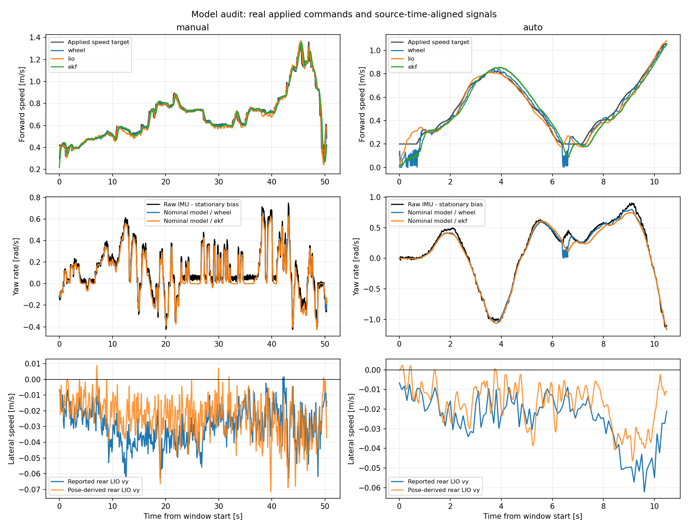

# 2026-10-06 模型误差核查

本轮目标仅是发现、记录可能的问题，修复留待后续。没有修改生产代码、实车配置或任何 submodule；没有启动控制器或发布控制指令。分析直接读取上一轮保存的 signals.npz，没有访问任何正在写入的 bag。

## 检查方法

采用 Autoware 的核查顺序：先确认车体参考点、轴距、速度和转角含义，然后检查执行器动态、转向零点和增益，再检查预测与实际运动的残差。本轮不做代价权重调参。

https://autowarefoundation.github.io/autoware_universe/main/control/autoware_mpc_lateral_controller/#how-to-tune-mpc-parameters

使用遥控窗口约 50 秒及首次自动窗口约 10.48 秒；没有完成的 0.5 m/s 一圈的完整传感器数据。全部信号按 header.stamp 对齐，输入使用实际 /ackermann_cmd，避免将 /drive 提议当成已执行指令。IMU 先减去自动开始前静止段的 gyro_z 中位数 0.018748 rad/s。

主要拟合条件为轮速 >0.35 m/s，分别覆盖遥控 49.03 秒、自动 6.805 秒。稳态诊断额外选择转向变化率 <0.15 rad/s、轮速变化率 <0.2 m/s²、速度 >0.4 m/s。统计网格点高度相关，不把它们当作独立实验次数或置信区间。

## 当前模型与代码核对

- 状态参考点为后轴中心 base_link，MPCC 求解在 odom 中进行。
- 所用轴距由 vehicle.yaml 显式传入 0.36 m。vendor 模块内的 0.324 m 默认值没有用于本次求解。
- 模型无独立侧向速度状态，假设后轴 vy=0；yaw_rate = v × tan(delta) / L，目前 understeer_coefficient=0。
- 转向采用 80 ms 一阶响应；delta 是按指令估计的有效转角，不是实测轮胎转角。优化器以 20 ms 子步积分、100 ms 区间内的转向目标渐变；执行端还有输出平滑。
- 纵向优化模型为 dv/dt=a，求出的速度经 speed 模式下发；没有独立电机时间常数或电机纯延迟。接管前的 AppliedHistory 桥接则按实际速度目标，以 ±0.5 m/s² 的限幅追踪。
- 读取 FAST-LIO 发布代码确认原始 twist.linear 已表达在传感器 body 坐标中，后轴转换并未把世界坐标速度误当车体速度。轮速消息里的 servo 推算 yaw rate 不用于本次模型比较或 EKF 融合。

## 发现 1：小幅但可复现的转向等效零点与增益偏差

以轮速和去静止零偏的原始 IMU 检验名义转向模型，横摆角速度 RMS 残差：遥控 0.0461 rad/s，自动 0.0477 rad/s。

固定 tau=80 ms、不加纯延迟，诊断拟合为：

| 拟合窗口 | 转角等效增益 | 转角等效偏置 |
|---|---:|---:|
| 遥控 | 1.024 | +0.911° |
| 自动 | 1.044 | +0.667° |

用遥控窗口拟合的增益与偏置去检验独立自动窗口，RMS 从 0.0477 降至 0.0344 rad/s。因此偏差不只是同一窗口上的拟合改善。稳态遥控段左转、右转均出现约 +0.9° 的平均等效角度残差，近直行段约 +1.2°；右转稳态覆盖较少。

证据支持存在小的系统偏差，尚不能认定它就是机械中位、舵机比例或真实轮胎转角。没有转角编码器，轮速标尺、轴距、IMU 残余偏置和车辆运动学误差都会影响该拟合。没有应用这些拟合值。

Autoware 的 steer offset estimator 也使用速度、轴距和横摆响应检查转向偏置，并选择相对稳定的运动段；它有转角反馈，当前车辆只有转角指令，因此本次只能称等效偏置。

https://autowarefoundation.github.io/autoware_universe/main/vehicle/autoware_steer_offset_estimator/

## 发现 2：后轴 vy=0 的模型假设与当前估计数据不完全一致

| 量 | 遥控行驶段均值 | 自动行驶段均值 |
|---|---:|---:|
| 后轴 LIO twist.linear.y | −0.0303 m/s | −0.0289 m/s |
| 后轴 LIO pose 差分得到的车体横向速度 | −0.0244 m/s | −0.0207 m/s |

pose 差分采用居中的 305 ms Savitzky–Golay 平滑导数，再按 LIO yaw 旋转到 body 系。这种导数只能检查趋势，不能用于精确瞬态延迟标定。pose 与 twist 来自同一 LIO 估计器，不是独立运动真值。

两种表示都显示持续负横向分量，模型则将其置零。可能来源包括安装轴线与车辆行进方向不一致、后轴参考点/杆臂误差、速度估计偏置、轮胎运动及真实侧滑。目前不能分开这些来源，不能把 atan2(vy,vx) 直接作为真实侧滑角写入参数。回归中的常数项较明显，不支持仅靠一个固定安装 yaw 就解释全部现象。

## 发现 3：杆臂补偿可能带入原始陀螺零偏

当前后轴转换用原始 IMU gyro，未减去其静止零偏。对 0.30 m 前向杆臂，0.018748 rad/s 的零偏会给转换后的 vy 引入约 −0.00562 m/s。

遥控段 reported vy 与 pose-derived vy 的均值差为 −0.00591 m/s，与上述量相近；自动段为 −0.00819 m/s。仅在诊断计算中减掉这项后，均值差分别约 −0.00029 / −0.00257 m/s。静止段也有约 −0.0046 m/s 的后轴 LIO vy。

这是值得记录的状态转换偏差候选；它能解释两种速度表示的一部分差别，不能解释全部约 −0.03 m/s 的行驶横向速度，更不能直接证明它导致控制摆动。没有改转换程序。

## 发现 4：纵向理想加速度模型缺少执行响应，低速段尤其不一致

实际 speed 目标与 wheel 速度瞬时差的 RMS：遥控 0.0253、自动 0.0261 m/s。诊断用一阶响应加延迟后，分别可降至 0.0109 / 0.0119 m/s。

遥控窗口最佳诊断组合 tau=100 ms、delay=30 ms；自动窗口为 tau=20 ms、delay=70 ms。输入激励不同，tau 与 delay 相互代偿，且 wheel 时间戳包含驱动接收及内部速度估计影响，不能将其中任何一个值认定为纯电机物理参数。

自动起步和减速到约 0.2 m/s 期间，wheel 与 LIO 差别明显。例如自动窗口 t=0.5 s：实际目标 0.20、wheel 0.115、LIO 0.298、EKF 0.089 m/s。不能断定哪一个等于真实车速；这里的误差已超出简单“固定整体时延”的描述，可能涉及低速 ERPM 反馈、车辆响应和 LIO 速度估计。

主要模型拟合排除了 wheel <0.35 m/s 的段，故较好的拟合结果不能用于宣称低速起步模型准确。此前 EKF 相对 wheel 的 105–115 ms 滞后也需单独保留，不能全部计入电机模型。

## 尚未发现：80 ms tau 或单轨模型存在巨大的短时预测失配

固定名义模型、使用真实未来已执行指令，做 100 / 200 / 400 ms 开环推演，并与后轴 LIO pose 位移比较。以 wheel 初始化速度时：

| 预测长度 | 遥控位置误差 P95 | 自动位置误差 P95 | 遥控 / 自动 yaw 误差 P95 |
|---|---:|---:|---:|
| 100 ms | 0.55 cm | 0.50 cm | 0.43° / 0.48° |
| 200 ms | 1.00 cm | 1.05 cm | 0.71° / 0.95° |
| 400 ms | 1.74 cm | 2.15 cm | 1.36° / 1.76° |

这是短时已知输入模型检查，不是 MPCC 完整计划预测的精度，也不预测人工或重新规划后未知的输入。比较参考是 LIO，初值也取其姿态；没有独立真值，且选择了速度 >0.35 m/s 的起点。不能将这些数值外推成全圈跟踪保证。

转向动态的交叉窗口拟合没有证明必须把 80 ms 改成其他值；不同 tau/deadtime 组合得到相近拟合，现有数据不足以独立辨识它们。

## 动态限制与现有数据的边界

lateral_accel_limit=1.0 m/s²、accel/brake_limit=0.5 m/s² 是当前规划假设，不是本次辨识出的轮胎抓地或电机极限。首次自动末段的实际速度与指令估计转角曾给出约 1.13 m/s² 的模型侧向加速度；这表明实时状态可能与规划假设不一致，但不证明某次未收敛请求一定不可行，也不证明真实轮胎极限已达到。

understeer_coefficient、真实侧滑和左右机械转角差异仍不能独立辨识。ETH 原始 MPCC 采用带轮胎与驱动模型的动态单轨模型；Autoware 默认也使用带转向响应的运动学模型。本车使用简化模型本身不代表错误，要看其与数据的残差。现有检查发现上述偏差候选，但还不能认定它们是摆动或超过一米横向偏离的主要原因。

https://github.com/alexliniger/MPCC

## 材料

- model_audit.py：本地离线分析，完全没有 ROS 发布或服务调用。
- model-audit-summary.json：全量统计与交叉窗口结果。
- model-audit.png：速度、横摆响应、横向速度对照图。

