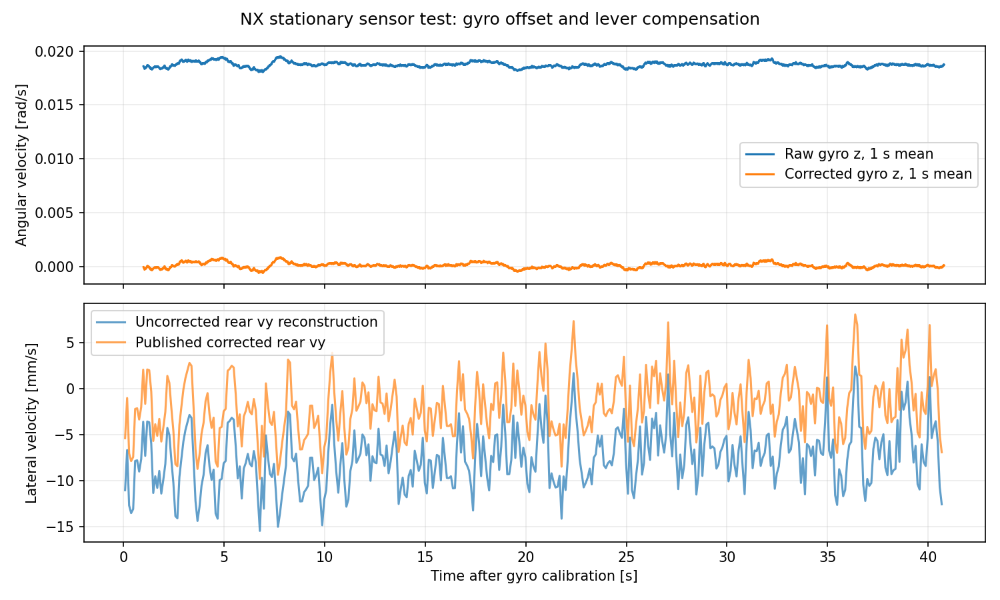

# NX 共享陀螺零偏修正与验证（2026-10-06）

## 本次修改

在 `/home/aims/AIMSRacer-fastlio-ndt` 的 `feat/fastlio-ndt-mpcc` 分支实现。保留此前 EKF Q(vx)=0.4 与 MPCC solver_max_iterations=50。未调整 MPCC 权重、机械转向零点或外参。

接线：

```text
/livox/imu ──→ FAST-LIO（原始数据，内部估计自身 bg）
    └──→ livox_gyro_bias
             └──→ /livox/imu_bias_corrected
                       ├──→ lio_to_rear_axle → /rear_axle/lio_odom
                       └──→ imu_to_rear_axle → /rear_axle/imu → EKF
```

补偿在原始 `livox_frame` 的三轴角速度上做一次 `omega_corrected = omega_raw - bias`。既有适配器再旋转到 base_link。速度杆臂转换为 `v_base = R v_livox - (R omega_corrected) × r`。两条后轴支路共享同一零偏，原始话题不被修改。

### 单位核对

实际 NX Livox 驱动源码：`/home/aims/livox_ws/src/livox_ros_driver2/src/lddc.cpp:490` 直接发布传感器字段；`src/comm/lidar_imu_data_queue.h:37` 标明 gyro 为 rad/s、acceleration 为 g。

新节点用加速度模长和波动判断静止，保持 g 单位及原始三个分量；不会把向量归一化，也不会扣除倾斜姿态下的重力。角速度按 rad/s 标定与扣除。当前 FAST-LIO `lio_node.cpp:221` 内部将加速度乘 10.0，IESKF 估计 bg 并在预测时扣除；后轴 IMU 转换的原有 accel_scale=9.80665。本次保留这两处现有实现。

消息源时间戳、frame_id、加速度和姿态字段保持不变。全零角速度协方差仍表示未知，交由原有适配器使用方差下限；已有非零协方差增加一个很小的零偏不确定性下限。ROS 数据语义参考：[sensor_msgs/Imu](https://github.com/ros2/common_interfaces/blob/humble/sensor_msgs/msg/Imu.msg)与[REP 145](https://github.com/ros-infrastructure/rep/blob/master/rep-0145.rst)。

## 标定行为

启动后要求连续静止 10 s、至少 1000 个 IMU 样本，使用三轴均值。轮速和 raw LIO 必须有同一源时间轴上的新鲜数据（默认年龄≤0.25 s）；轮速绝对值≤0.02 m/s，LIO 速度模长≤0.025 m/s。LIO 位姿在窗口内位置变化≤2 cm、姿态变化≤0.01 rad；陀螺和加速度波动也需通过检查。运动、数据缺失或不稳定会重启窗口。

标定成功后冻结零偏，真实转弯角速度不会被持续学习成偏置。源时钟回退则清除状态，重新等待标定。窗口有样本数量上限。倾斜静止允许标定。

**启动行为：**标定完成前不发布 corrected IMU，后轴 IMU/LIO 适配器因此等待。轮速 EKF 可能仍发布 odom；不能只看到 odom 就认为标定已完成。V2/V3 正常启动后保持静止，确认下述状态 ready=true，再初始化全局定位和开始轨迹控制。配置为 `src/aims_racer_system/params/gyro_bias.yaml`，标定每次启动执行，不写死历史包的某个数值。

```bash
ros2 topic echo /imu/gyro_bias/status --once
```

上述命令使用正常车辆 ROS 图的环境。测试用的 domain 94/95、localhost 和临时 DDS 配置只作用于本次测试进程，不应复制为车辆全局设置。

## 现场结果

用户确认车体架起固定、雷达和 VESC 通电；无需水平。本次最终现场传感器采集 `live-static-final`，标定使用 2002 个样本；标定后排除首秒，使用约 39.8 s 的后续静止数据核对。

| 指标 | 实测 |
|---|---:|
| 标定 gyro bias x/y/z | −0.001822 / +0.000368 / +0.018648 rad/s |
| 后续 raw gyro z 均值 | +0.018743 rad/s，约 1.074°/s |
| 后续 corrected gyro z 均值 | +0.0000945 rad/s，约 0.0054°/s |
| 后续 EKF yaw-rate 均值 | +0.0000954 rad/s |
| corrected IMU 频率 | 199.95 Hz |
| EKF 输出频率 | 199.96 Hz |
| raw→corrected 捕获延迟 P50/P95/max | 0.59 / 0.83 / 4.20 ms |

静止均值偏置明显下降，单帧陀螺噪声仍然保留；这些数据不证明长期温漂或运动闭环表现。延迟是同一捕获进程看到原始与修正消息的差值，包含 DDS/调度，不等于单纯函数耗时。

现场同数据未修正杆臂公式重建的后轴 vy 均值约 −0.00753 m/s，新发布值约 −0.00188 m/s，变化中位数 +0.005649 m/s，与 bias×lever 计算一致。旧场地行驶数据中约 −0.03 m/s 的横向分量不能因此宣称全部消除。



### 现场测试边界与环境问题

使用传感器专用 launch，仅启动 Livox、FAST-LIO、VESC 反馈、轮速转换、后轴适配器和 EKF。没有启动 RC 控制、selector、ackermann_to_vesc 或 MPCC；捕获脚本持续检查 /drive、/ackermann_cmd、/commands/motor/speed、/commands/servo/position 的 ROS 发布者数量为 0。VESC 驱动保留自身零速看门狗。

第一次 `live-static` 在 localhost 隔离下遇到 DDS participant index 上限，两个节点没有启动，未作为补偿成功证据。一次 `live-static-retry` 命令的内联 XML 配置转义失败，保留为空/失败记录。之后 `live-static-validated` 修正 DDS 上限，但轮速转换仍等待舵机命令，未通过标定。最终使用独立且展开后的传感器测试参数文件关闭“由舵机命令计算角速度”，直接读取真实 ERPM 作为轮速，`live-static-final` 完成验证。

这些调整仅在证据目录的 sensor_only.launch.py、vesc_sensor_test.yaml、dds.xml 中，生产 vesc.yaml 未修改。捕获结束已关闭本次启动的进程。

## 离线与回归结果

1. 静止 ROS 回放：旧场地包 offset=15 s，实际安装的共享节点与两个后轴适配器。标定 1997 样本，gyro z bias=0.020393 rad/s。后续约 15.96 s 中 z 均值由 +0.020227 降至 −0.0001665 rad/s；corrected 频率 199.69 Hz，消息传递延迟 P95=0.76 ms。
2. 同数据后轴 vy 未修正重建约 −0.00591 m/s，新发布值 +0.000211 m/s，变化与杆臂公式一致。
3. 行驶段 ROS 回放：offset=396 s，收到 4858 个原始 IMU 样本，标定保持未就绪，修正流输出 0 帧；确实拒绝将行驶数据学习为零偏。
4. 逐消息验证：原始与修正消息使用相同源时间戳，角速度恰好只扣一次零偏，加速度逐项完全一致；后轴 IMU 角速度与 shared corrected stream 一致。
5. 行为回归覆盖：倾斜静止三轴标定、运动/慢速旋转拒绝、连续静止窗口、缺失/未来观测、时钟回退、转弯保留、未知协方差、传感器轴零偏先扣再旋转和杆臂补偿，以及两条支路共享接线。共享接线测试在修改前观察到失败。
6. aims_racer_system 已重建，6 个 CTest 项目通过；colcon test-result 汇总为 45 项测试、0 错误、0 失败、0 跳过。

## 文件与复现

实现文件：

- `src/aims_racer_system/aims_racer_system/gyro_bias.py`
- `src/aims_racer_system/scripts/livox_gyro_bias.py`
- `src/aims_racer_system/params/gyro_bias.yaml`
- `src/aims_racer_system/launch/rear_axle_frames.launch.py`
- `src/aims_racer_system/tests/test_gyro_bias.py`、`test_rear_axle_contract.py`
- CMakeLists.txt 注册 gyro 行为测试。

全部证据和脚本：`/home/aims/aimsracer-data/sessions/2026-10-06/gyro-bias-correction`。包含 implementation-plan.md、replay.py、live.py、sensor_only.launch.py、analyze.py、summary.json、各次 streams.npz/status.json/nodes.log。

离线复现需 source Humble、Livox、原 AIMSRacer underlay 和集成 overlay，然后仅对测试进程设置 ROS_DOMAIN_ID=94、ROS_LOCALHOST_ONLY=1、RMW_IMPLEMENTATION=rmw_cyclonedds_cpp。replay.py 参数：静止 --offset 15 --duration 40，行驶 --offset 396 --duration 30，选择新 --label 避免覆盖。大 bag 播放器有装载等待，墙钟时长大于实际捕获源时长。

## 结论与剩余边界

已修正并验证原始陀螺零偏进入后轴杆臂补偿与 EKF 的路径。FAST-LIO 输入、IMU 采样频率、加速度单位和机械转向参数保持原值。本次未做实车运动或闭环轨迹验收。

冻结零偏会随温度/长时间运行产生残余漂移；当前方案每次启动重新标定，持续温漂需另外验证。尚未修复全部行驶横向速度、转向等效零点或运动模型问题。

修改位于 NX 当前分支，尚未提交或推送。
