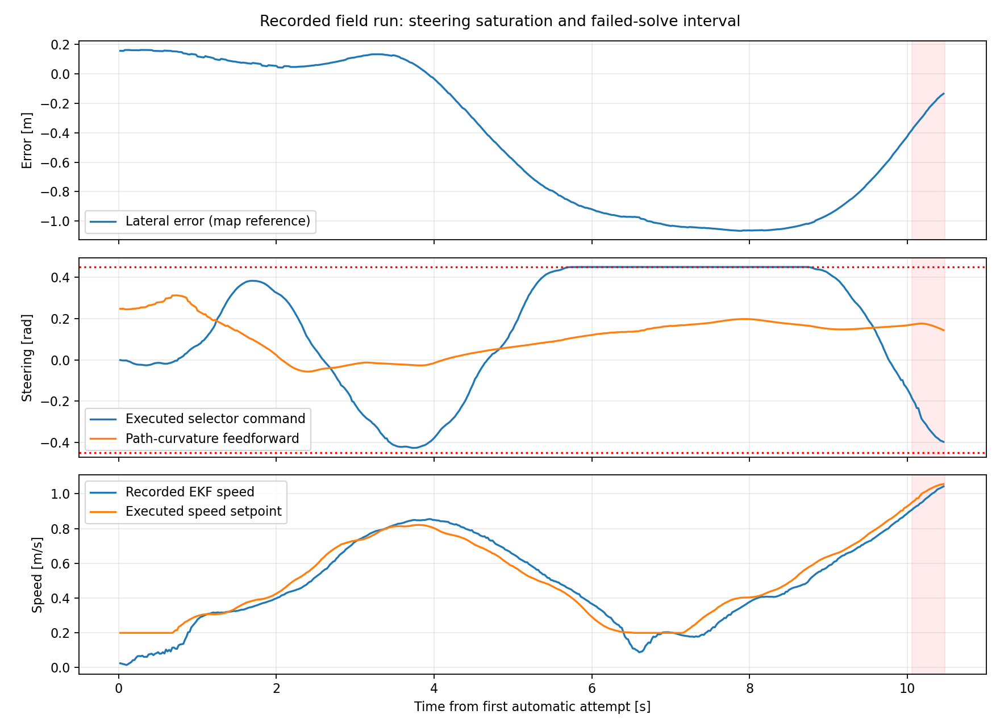
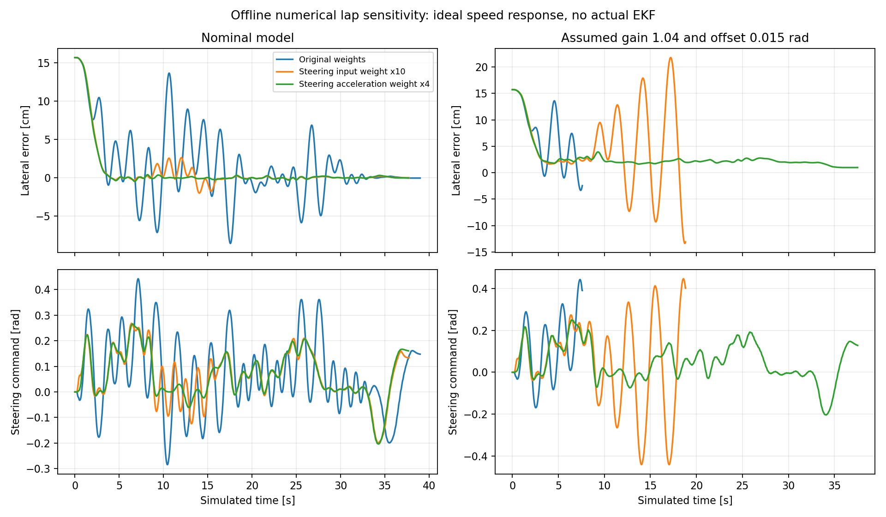

# MPCC 权重与摆动原因调查（NX，2026-10-06）

> 本报告记录权重调查时刻；随后生产迭代上限已改为 50，并完成共享 gyro 零偏修正。权重候选仍未部署，详见[交接总览](2026-10-06-analysis-handoff.md)。

## 范围与结论

本轮核对 NX 当前代码、10 月 5 日已关闭的场地数据和既有调查，再补充单变量离线敏感性实验。未启动实车控制，未修改 MPCC 生产配置；上一任务的 EKF Q(vx)=0.4 继续保留。

目前最值得验证的权重候选是 **steering_acceleration_weight: 0.3 → 1.2**，优先增加对转向变化率突变的惩罚。它在本次数值实验中比单独增加 steering_rate_weight、降低 contour_weight，或增加 steering_weight 更一致。它不是已验证的实车修复，也尚未经过新 EKF 配置下的真实闭环验证。

证据同时指向转向等效偏置、未建模的横向速度、低速指令与速度反馈差异、重规划/求解可行性等因素。不能将摆动全部归结为权重。

## 当前真正使用的权重

代码：`src/controller/aims_mpcc/solver.py:123` 至代价构建；配置：`src/controller/config/vehicle.yaml`。安装 overlay 使用该集成仓库，仓库基线提交 0a5b9ed。

| 项目 | 权重 | 归一化尺度/定义 |
|---|---:|---|
| 横向误差 | 16 | 0.05 m |
| 航向误差 | 4 | 0.05 rad，周期代价 2(1−cos(eψ)) |
| 速度误差 | 133.333 | 0.60 m/s |
| 转向偏离曲率前馈 | 0.667 | 0.314159 rad |
| 转向变化率 | 0.3 | 2 rad/s |
| 转向变化率的变化 | 0.3 | 2 rad/s² × 0.1 s |
| 终端项 | 3 | 同时放大终端横向、lag、航向、速度项 |

还存在固定 lag=26.667、进度速度误差=1.333、加速度=0.333 等项。不能只按 YAML 数字排序重要性。

主要侧向单步代价为：

`16 (ey/0.05)^2 + 4 × 2(1−cos(eψ))/0.05² + 0.667 ((δcmd−δff)/0.314159)^2`

示例：横向 5 cm 的代价为 16；航向 3° 的代价约 4.39；偏离前馈转角 0.1 rad 的代价约 0.0676。横向 20 cm 的代价为 256。这里是给定误差下的数学例子，不是最优计划的真实代价占比。

**5 cm 是尺度，不是归一化最大值或截断点。** 改成 24 cm 并保持权重 16，会把横向项减弱到原来的 1/23.04，等价于原尺度下 contour_weight≈0.694。若仅改尺度、保留相同数学代价，则权重需变成 368.64。归一化尺度和权重必须一起解释；门控允许通过的偏差不能自动成为最佳跟踪尺度。

横向与航向不是天然相斥。离开轨迹后，回线本来需要暂时形成航向误差；过强的航向项可能阻碍回线，而过强的横向项可能促成急转纠偏。模型动态、预瞄范围和转向惩罚决定两者如何配合。旧实验将 heading 从 4 提至 16 并没有改善所检查的横向 P95。

当前 enforce_corridor=false。30 cm 的计划交接位置检查不是横向代价尺度，也不能直接当成横向误差门槛。

## 场地数据重新核对

来源：`/home/aims/aimsracer-data/sessions/2026-10-05/225646-field-ndt`。首次自动段约 10.48 s 有完整传感器数据；后续 0.5 m/s 完整圈只有控制器日志和独立健康观察，不能假设有完整传感器 bag。

按 20 ms 网格重新核对首次自动段：

- 实际 selector 转向命令约 30.6% 的样本满足 |δ|≥0.44 rad，接近 ±0.45 rad 限幅。
- 本段曲率前馈 |δff| 最大约 0.313 rad；较大转角不仅来自轨迹本身，也来自纠偏。
- 横向误差最大约 1.066 m，航向误差最大约 58.4°。这已经是严重偏离后的状态，不能通过事后代价大小证明最初的因果顺序。
- 最近点进度在 20 ms 网格上的最大相邻变化约 3.1 cm，未在这段发现明显的轨迹关联跳跃；不能外推到大偏离或相邻路线更近的情况。
- 自动段 /drive 提议至 selector 的匹配延迟 P95≈7.1 ms，selector 至 servo 命令 P95≈1.8 ms，且没有未匹配样本。软件指令链未表现为主要长延迟；servo echo 也不是实测轮胎转角。
- NDT map→odom 最大相邻变化约 1.8 cm、0.33°。没有发现足以单独解释一米偏离的大跳，但小修正与强误差反馈的耦合仍值得观察。
- 约 12.1% 的 RUNNING 状态样本发生 minimum_drive_speed 映射：模型命令低于 0.2 m/s，实际输出被抬到 0.2 m/s；最后一处约在 7.12 s，说明不只存在于首次起步。

状态误差代价快照显示强纠偏倾向，但不等于实际求解中的预测代价分解：日志没有保存全部最优状态/控制。重新计算的 TF 采用最后收到的 map→odom，其他信号按源时间对齐；存在时间对齐近似。

## 停车与规划时序

首次自动运行约 10.06、10.22、10.41 s 依次收到三个 Maximum_Iterations_Exceeded，10.48 s 因旧计划过期停车；第四个失败结果尚在途。返回结果都没有超过 250 ms 时间预算，交接拒绝计数为零。

因此此次停车直接对应“持续没有新的成功计划”，并非单纯求解耗时超限。失败是否来自特定请求不可行、数值条件或局部解，缺少失败请求完整状态/约束残差，不能确定。

当前：重规划 5 Hz（200 ms）、预测 dt=100 ms、horizon=10（约 1 s）、输出 tick 20 ms（50 Hz）、固定预测交接时间=200 ms。代码会逐点插值执行计划，并按已执行指令预测到交接时刻，二者频率不同本身不构成 bug。

但在 200 ms 期间，新的状态误差反馈不能改变已经生成的优化计划；计划失败则继续使用旧计划直至 TTL=0.8 s。因此激进纠偏、状态/模型偏差和连续失败可互相放大。不能直接把重规划提升至 10 Hz：当前交接时间也会减到 100 ms，而实车求解/通信 P95 可能超过它，需要同时检查调度预算。

## 新增单变量短时实验

证据目录：`/home/aims/aimsracer-data/sessions/2026-10-06/mpcc-weight-response`。

使用当前安装的 MPCCSolver、Supervisor、AppliedHistory 和原场地地图轨迹，保持 1 m/s 目标、horizon=10、5 Hz、dt=0.1、30 次迭代及所有硬限制；同一个起点。仅在离线副本改变一项权重。

两个条件：名义转向模型；假设实际转向增益 1.04、等效偏置 0.015 rad 的扰动模型。这是根据既有残差选择的压力测试，不是已标定硬件模型。

| 12 s 实验 | 名义 P95 / 失败求解数 | 扰动 P95 / 失败求解数 |
|---|---|---|
| 原权重 | 11.55 cm / 2 | 12.87 cm / 3，计划过期 |
| contour 16→4 | 14.32 cm / 0 | 16.03 cm / 0 |
| steering 0.667→2.667 | 8.62 cm / 4，计划过期 | 9.40 cm / 3 |
| steering 0.667→6.667 | 3.98 cm / 0 | 11.21 cm / 0 |
| steering_rate 0.3→1.2 | 9.85 cm / 3，计划过期 | 7.93 cm / 0 |
| steering_acceleration 0.3→1.2 | 3.87 cm / 0 | 4.97 cm / 0 |

表中 P95 排除最初 2 s。提前失败的样本时长更短，不能仅按 P95 排名；状态和失败次数必须一起看。

## 延长至完整数值圈

将原权重和两个较好的候选延长至最多 50 s，其他条件一致：

| 单变量候选 | 名义模型 | 扰动模型 |
|---|---|---|
| 原权重 | 完成；P95=8.51 cm；3 次失败求解 | 7.60 s 计划过期 |
| steering 0.667→6.667 | 完成；P95=1.99 cm；0 次失败 | 18.82 s 计划过期 |
| steering_acceleration 0.3→1.2 | 完成；P95=0.42 cm；0 次失败 | 完成；P95=3.06 cm；0 次失败 |

P95 仍排除最初 2 s；完成由现有 Supervisor 完圈停止条件判定，参考进度约 33.17 m，轨迹全长 33.47 m。终点容差不是精确重合要求。

最后一项名义转向总变化由 12.11 降至 3.51 rad，P95 命令变化率由 0.704 降至 0.286 rad/s。整圈时长不同，总变化还包含轨迹转弯，不能称为纯摆动频率。

**数值模型边界：**速度对命令理想响应、没有真实 EKF 或传感器噪声、固定 map→odom、模拟结果在 100 ms 后返回、200 ms 交接、没有真实 CPU 共载。新 EKF 的速度响应改善未被当成固定延迟或时间常数塞进模型。小于厘米的名义误差不能当成实车精度承诺。

## 其他原因与排查优先级

1. **转向偏置与权重/求解耦合。**原数据交叉窗口拟合支持约 +0.7～0.9° 等效偏置、约 2～4% 增益差；本次扰动实验暴露了参数对模型偏差的敏感性。不能由此直接写入机械零点参数，需区分 gyro 偏置、轮速尺度、轴距和真实转角。
2. **后轴横向速度与模型不一致。**模型假定后轴 vy=0，原 LIO twist 行驶均值约 −0.03 m/s，pose 导数也有约 −0.02～−0.024 m/s。它可能使车辆实际运动方向与模型预测不同。两种量都来自 LIO，缺少独立真值，不能直接当成真实侧滑角。
3. **原始 IMU 零偏与杆臂补偿。**静止 gyro_z 约 0.01875 rad/s，0.30 m 杆臂可引入约 −0.0056 m/s 横向速度项；解释部分差异，无法解释全部约 −0.03 m/s，更未证明它造成摆动。
4. **低速和纵向模型。**OCP 使用 dv/dt=a，实际下发速度模式；没有独立电机响应模型，且存在 0.2 m/s 指令映射。部分低速段 wheel、LIO 差异较大。先前 EKF vx 响应滞后已改善，但这些剩余差异并未因此消失。
5. **求解失败、执行平滑与硬限制。**转向角、变化率、变化率的变化、加减速/侧向加速度联合限制均需看贴边情况。计划初始状态不满足联合约束的可能性值得记录，但本次实车失败请求缺少日志，尚未证明。现有 80 ms 转向 tau 的短时交叉窗口检查没有证据支持必须修改。
6. **参考轨迹/地图更新。**本段没有明显关联跳跃或巨大 TF 修正；仍应记录参考进度、曲率和 map→odom 更新，确认摆动是否与局部轨迹或修正相关。

## 推荐下一步

固定新 EKF 与全部模型/硬约束，首先做 steering_acceleration_weight 为 0.3 / 0.6 / 1.2 的单变量对照，优先同一轨迹 0.5 m/s 工况。记录完整传感器和控制器计划、失败请求初值、求解残差、代价分项、实际选择命令；同工况重复比较。

指标包括完整圈是否完成、横向误差 P50/P95/最大值、直线与弯道表现、相对曲率前馈的转向纠偏、变化率、饱和时间、求解成功率及实际速度。候选有效后再逐步恢复 1 m/s。本轮未应用候选。

先不同时改 contour、heading、speed、terminal 或转向硬限制。其他模型偏差作为独立验证项处理，以保留因果判断。

## 方法参考

[Autoware 官方 MPC 调参指南](https://autowarefoundation.github.io/autoware_universe/main/control/autoware_mpc_lateral_controller/#how-to-tune-mpc-parameters)建议先检查运动学、动态响应、输入信号与转向零点，再用跟踪权重与输入惩罚之间的取舍观察摆动和精度。它支持本次排查顺序；其线性 MPC 参数数值不能直接移植到本车非线性 MPCC。

[MathWorks 归一化说明](https://www.mathworks.com/help/mpc/ug/scale-factors.html)及[权重调节说明](https://www.mathworks.com/help/mpc/ug/tuning-weights.html)作为尺度与相对权重的背景参考，不构成本车闭环稳定性保证。

详细结果：`field-derived.json`、`sensitivity-summary.json`、`lap-summary.json`、各条件 samples/solves JSON、`field_analysis.py`、`sensitivity.py`、`lap_sensitivity.py` 和冻结配置 `vehicle.baseline.yaml`。既有依据保留于原 session 的 diagnostics/weight-review.md、model-report.md、audit-summary.json。
