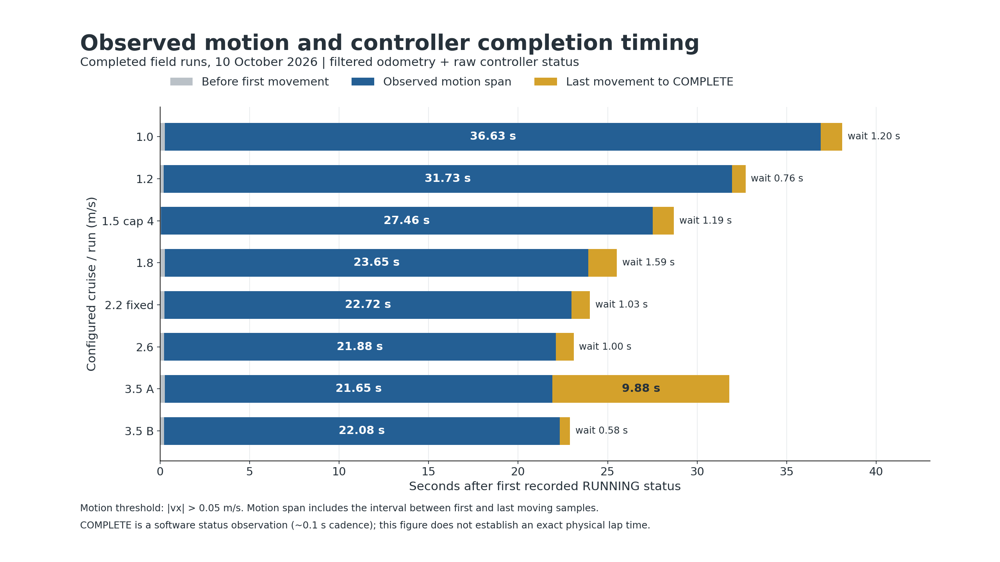
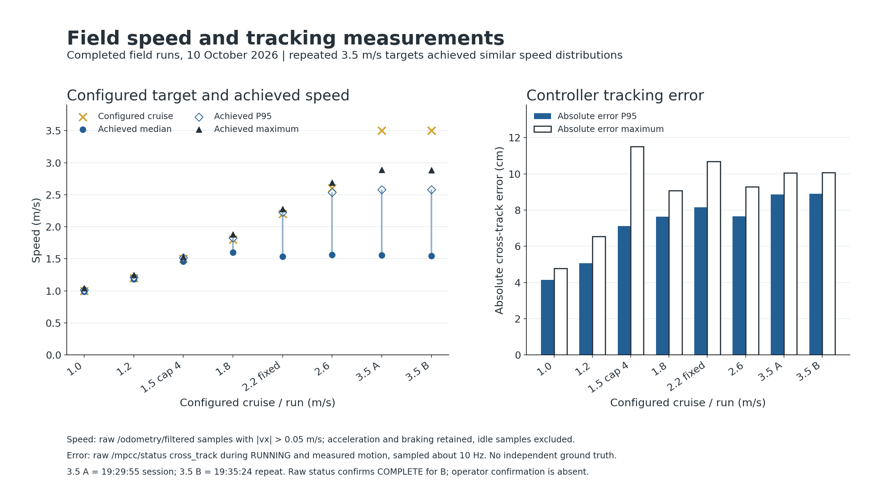
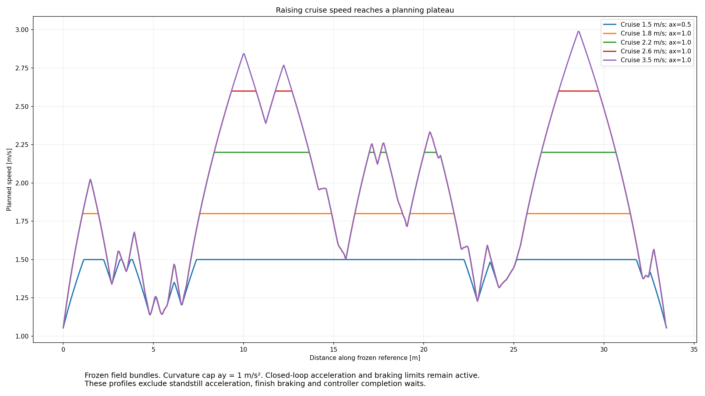

# 2026-10-10 NX 外场复盘与圈速优化方向

## 1. 本次结论

新 acados/C++ MPCC 已有多轮实际行驶记录。当前提高圈速的主要空间在**速度规划、轨迹几何和分段调参**，这批数据不支持优先更换求解器或盲目扩大预测节点数。

- 15 个记录目录，其中 14 个存在可提取 bag；准备、短段、中断与完整行驶分开统计。原始 runtime 捕获共 5,749 次请求，`deadline_expired=0`。28 次候选失败来自 1.5 m/s 巡航紧贴同值硬上限；原生状态码均为 0，不等于 IPOPT 式迭代超时。
- 后期 N15、dt=0.1 s、RTI 至多两次，在真实 FAST-LIO2＋EKF＋NDT 链路下完成运行。两次 3.5 配置完整求解处理 P95 为 4.001/2.656 ms，P99 为 6.498/4.611 ms，最大 8.374/5.822 ms。此指标含 worker 完整计算，与原生求解时间、输出周期分别统计；50 ms 完整交付预算未触发。
- 3.5 m/s 是配置巡航目标。冻结速度规划实际峰值 **2.990 m/s**；两轮滤波里程计峰值 **2.887/2.885 m/s**。不能报告“实车已跑到 3.5 m/s”。
- 首次 3.5 配置 COMPLETE 较晚主要是终点收尾：运动窗口 21.65 s，最后运动至 COMPLETE 等待 9.88 s；同配置第二次等待仅 0.58 s。不能把首次的 31.80 s 当作整圈行驶速度明显下降。
- 最后 `193524` 缺失 rosbag `metadata.yaml`、人工总结和监控报告，但 SQLite 可读、选定消息解码无错误，原始 `/mpcc/status` 确认最终 COMPLETE，里程计显示停稳。没有补造人工确认，也没有修改原 bag。

## 2. 测量口径与数据位置

原始数据保留在 NX：`/home/aims/aimsracer-data/sessions/2026-10-10/mpcc-acados/`（约 20 GB）。本地主证据目录：`/home/elesheep/aimsracer-data/sessions/2026-10-10/mpcc-field-review/`，含源文件快照/哈希、原始轻量日志、只读 bag 提取、可复现分析脚本、完整回归日志。

- **运动窗口**：首次 RUNNING 后，滤波里程计 `abs(vx)>0.05 m/s` 的首末时刻差；排除之后手动移动。它是本次从静止出发、终点制动测试的近似运动时间，不是独立计时的 flying lap。
- **状态完成时间**：首次 RUNNING 到首次 COMPLETE 的 bag 接收时间差，约有 0.1 s 状态采样误差。另列终点等待，避免混入圈速。
- **速度**：运动样本的 EKF 纵向速度；横向误差来自控制器诊断，以当前定位和冻结参考为基准，均非外部真值。
- **P95**：95% 样本不超过该数值；各项样本数和分位数计算见 CSV/JSON，不能混用来源不同的 P95。
- 跨 topic 使用 bag 接收时间窗口，消息 source 时间单独用于年龄/间隔分析；不把定位 topic 年龄都归因于 CPU 计算。

[全部原始 bag 摘要](assets/2026-10-10-field-review/bag_metrics.csv)、[全部 runtime 汇总](assets/2026-10-10-field-review/runtime_runs.csv)、[冻结速度规划汇总](assets/2026-10-10-field-review/speed_profiles.csv)。原始 bag 和生成 bundle 不随 Git 发布，复算需要上述外部证据目录。

## 3. 后期行驶对照

以下为原始 bag 核验值，速度列为运动样本 P95 / 峰值，误差为控制器绝对横向误差 P95。

| 配置巡航 | 记录 | 运动窗口 | RUNNING→COMPLETE | 末动后等待 | 实测速度 P95 / 峰值 | 横向误差 P95 |
|---|---|---:|---:|---:|---:|---:|
| 2.2 m/s | 192020，clockfix | 22.72 s | 24.00 s | 1.03 s | 2.230 / 2.279 m/s | 约 8.2 cm |
| 2.6 m/s | 192725 | 21.88 s | 23.10 s | 1.00 s | 2.536 / 2.687 m/s | 约 7.6 cm |
| 3.5 m/s | 192955 | 21.65 s | 31.80 s | 9.88 s | 2.581 / 2.887 m/s | 8.87 cm |
| 3.5 m/s | 193524 | 22.08 s | 22.90 s | 0.58 s | 2.583 / 2.885 m/s | 8.89 cm |

这些是不同单轮样本，不能据 0.2–0.4 s 差异建立可靠统计排序。最终两轮最大诊断横向误差约 10.1 cm，未见求解超时；需要多轮同配置、相同起终计时后再判定稳定圈速增益。

后期三轮（v26/v35a/v35b）运动期间定位健康分别有 435/425/443 个样本，全部 `ready=true`、`state=tracking`、level 0。FAST-LIO 里程计到录包接收时的 source 年龄 P95 约 190/206/165 ms；控制器最新 EKF 状态 source 年龄最大约 17.6/21.4/12.6 ms。EKF 高频输入新鲜不代表 LIO 测量延迟为零，仍需分开评估；这三轮无定位失去资格证据。

`173245` 与 `180217` 的原始状态从未进入 enabled RUNNING，不能当作完整行驶或失败圈；`182112` 没有 bag。

早期事件保留原貌：

1. `172739_v05_lap01`：FAST-LIO 相邻 IMU 时间间隔检查导致退出，属于输入处理故障，与 MPCC 求解超时无关。
2. `185831_v15_n15_independent_lap01`：巡航/硬上限都为 1.5，EKF 短暂超调至约 1.54，28 次独立候选拒绝、36 次接管拒绝后旧计划寿命耗尽。后续只提高硬边界至 4，巡航仍 1.5，完成一圈。边界、目标速度不是同一概念。
3. `190848_v18_n15_accel1_cap4_lap01`：原始状态确实有 RUNNING→RECOVERING / Plan expired→STOPPING→COMPLETE。监控 `complete=false` 与最后完成可以同时成立；不能删掉该收尾事件。
4. `191317_v22_n15_accel1_cap4_lap01`：等待 mutex 前采样时钟，等待期间其他回调记录更晚时间，造成回退误判。修正采样顺序后 `192020` 完成，真实时钟回退仍会撤销执行。
5. 终点附近仍有独立候选预测负速度触及零下限、接管拒绝现象。`192955` 的 103 次接管拒绝中 93 次发生在最后正驱动命令之后。该问题主要影响停车完成统计，不能据此认定行驶中连续求解失败；当前不把它扩展为竞速算法重构。

### 同时运行时的负载

运动窗口对齐后的 tegrastats（约 1 s 采样）：

| 记录 | 八核 CPU 平均占用 / P95 | 单核峰值 | CPU 温度峰值 |
|---|---:|---:|---:|
| 192725 | 80.99% / 82.98% | 93% | 65.88°C |
| 192955 | 81.40% / 84.00% | 92% | 65.84°C |
| 193524 | 74.61% / 78.09% | 91% | 65.84°C |

CPU 均值先对八核取平均，再对窗口采样平均；100% 表示八核均满载。这是所有并行进程的联合负载，不能分摊为 MPCC、NDT 各自占用。RAM 均值约 4.58–4.60 GB；三轮日志 CPU 频率字段均为 1984 MHz，未见下降，但没有 thermal throttle 标志/内核热事件证据，不能断言绝无热限频或该值就是硬件最高频率。1 s 日志不能观察毫秒级尖峰。求解器已快，不代表整机负载低；后续避免无依据地增加模型、节点和线程规模。

[负载汇总](assets/2026-10-10-field-review/load_metrics.csv)。

## 4. NX 最新源码已纳入版本控制

现场源文件先按哈希保全，再同步至本地并验证：

- AIMSRacer 分支 `feat/mpcc-acados-runtime`：增加显式 `combined_accel_constraint_enabled=false` 实验。生成 OCP、候选重积分、执行认证、制动预算一致移除组合加速度椭圆；保留独立速度、加减速、转角、转向速率与有限数检查。旧配置未指定该字段时仍默认 true。
- 曲率速度规划仍使用 `lateral_accel_limit=1`。关闭实时椭圆不意味着横向能力无限，也不意味着规划值具有轮胎硬约束保证。
- `RuntimeNode::odometry` 时钟采样移至持锁后；回归测试同时验证排队不误报和真实回退仍失效。
- FAST-LIO 分支 `perf/serial-lio-worker`：删除相邻 IMU source 间隔大于 30 ms 就 fatal 的检查，保留时间回退、非有限值、缓冲溢出与实际 scan-end IMU 覆盖检查。间隔放行不证明没有真实缺包；采集健康仍需监测。
- 保存最后现场配置 `src/controller/config/vehicle_field_20261010_v35.yaml`，**不替换默认配置**。复现需要 N15 / dt=0.1 s、正确地图/参考、重新生成并在目标平台编译 bundle。
- 补全独立加速度 C++ 测试在 CTest 的注册；测试用圈时积分加入 spline tangent norm，仅影响测试时长估计。

验证：本地 Python 67 项通过；本地与 NX 原生各 31 项通过（含三项新注册独立约束测试）；NX FAST-LIO 十项缓冲检查与八项隔离 ROS 运行检查通过。首次本地 Python 运行缺少 acados 动态库路径而有四项加载失败，正确设置 SDK/LD_LIBRARY_PATH 后完整重跑通过；不将环境失败隐去或称作生产回归。

源码和文档按当前实验分支同步，未合并 main；`feat/aims-mpcc` 也仅更新 FAST-LIO 子模块指针至同一现场修复，不引入新 MPCC 后端。NX 原始现场 diff 另外保留在命名 stash/证据快照，其他历史 NDT worktree 的未提交修改保留。现有正在使用的启动环境/场地 bundle 保持可复现，不用新编译产物替换旧记录中的二进制哈希。

## 5. 为什么只加巡航速度几乎没效果

当前参考物理长度约 **33.471 m**。速度规划已按曲率与周期加减速做了全圈前向/后向传播：

\[
v_{curve}(s)=\sqrt{a_{y,planner}/|\kappa(s)|},\qquad
T_{rolling}=\int \frac{\|r'(s)\|}{v_{profile}(s)}\,ds.
\]

冻结系数积分 40,000 个样本，重算生产 SpeedPlanner 与存档速度节点最大差约 `5.34e-12 m/s`。**理想滚动时间**不包含从静止加速、终点停车、执行误差和完成状态等待。

| 巡航配置 | 规划峰值 | 理想滚动时间 |
|---|---:|---:|
| 1.8 | 1.800 m/s | 20.523 s |
| 2.2 | 2.200 m/s | 18.988 s |
| 2.6 | 2.600 m/s | 18.456 s |
| 3.5 | 2.990 m/s | 18.360 s |

从 2.6 提至 3.5，配置值增加 34.6%，理想收益仅 **0.096 s / 0.52%**。3.5 配置约 70.6% 的采样位置受到前后向加减速传播进一步压低速度（低于瞬时曲率/巡航上限至少 0.02 m/s）。低曲率直段也未必够长，不能凭巡航值让车瞬间达到该速度。

同一路线的**未执行离线假设**：将规划 ay 从 1.0 提至 1.25/1.5，保持加减速 1.0、巡航 3.5，理想滚动时间约 16.879/15.761 s。它说明哪个参数存在优化空间，不证明实车允许对应侧向加速度，也不保证实际达到该圈时；实际能力与跟踪余量须分段逐级验证。

## 6. 竞速团队的做法，以及我们应借鉴什么

### ForzaETH：先优化路径和分段速度，重复实车测圈

[ForzaETH 的 JFR 论文](https://arxiv.org/html/2403.11784v2) 采用最小曲率路径、前后向速度传播、赛道分段速度缩放，再以实车数据调参；速度前瞻还考虑车辆响应延迟。论文十次实车重复中，人工、均匀、贝叶斯缩放的平均圈时接近，误差却不同，说明需要同时看圈时和一致性。其车辆的时间参数不直接移植到 AIMSRacer。

我们已有曲率/加减速全局规划，缺的是**按位置可调的速度区域、稳定重复计时、实车能力约束和实际赛道边界**。并非再从零添加 SpeedPlanner。

### TUM：在赛道边界内优化 racing line 与物理速度剖面

[TUM 全局轨迹优化](https://github.com/TUMFTM/global_racetrajectory_optimization) 提供最短路、最小曲率和最短时间路线，配合 [速度规划辅助库](https://github.com/TUMFTM/trajectory_planning_helpers/blob/master/trajectory_planning_helpers/calc_vel_profile.py) 的周期前后向传播。减少弯道曲率能在相同横向能力下提高弯速，也可能牺牲路线长度，需比较总时间。

我们当前轨迹是记录得到的固定线，`enforce_corridor=false`，JSON 中左右各 0.5 m 不等于测量的真实边界。若继续严格跟踪已有保存轨迹，先做其速度优化；只有用户决定改 racing line、并有地图对应的可行边界后，再优化路线。不能从人为宽度直接推断可安全切弯。

### Liniger / NPU：把进度收益直接写入目标，但仍受物理与局部速度限制

[Liniger MPCC](https://github.com/alexliniger/MPCC/blob/master/C%2B%2B/Cost/cost.cpp) 除轮廓/滞后成本外，直接奖励进度速度，配合 [赛道与轮胎约束](https://github.com/alexliniger/MPCC/blob/master/C%2B%2B/Constraints/constraints.cpp)。[NPU 固定版本](https://github.com/npu-ius-lab/Roboracer_China_2026/blob/6c5012b9cd310c8fca5281c408298ffb5d4b3885/controller/src/f1tenth_dynamic_mpcc/python/f1tenth_dynamic_mpcc/acados_solver.py) 也有进度奖励，并使用运行时曲率速度规划与局部速度上限；不是只提高常数目标或删除全部限制。

当前 AIMSRacer 更偏固定轨迹/速度规划跟踪：实际速度和虚拟进度速度都追随 vref，没有同样的线性进度奖励。引入竞速目标是值得评估的 MPCC 改进，但不能靠更激进权重突破物理和空间约束。当前 N15×0.1 已有 **1.5 s 预览**，NPU N25×0.05 为 1.25 s，节点更多不意味着时间看得更远。

## 7. 建议的下一步顺序

1. **先得到可比的重复圈数据**：把起终停车与行驶计时分开，固定 start/finish 横截面；每套参数重复至少 3–5 轮，看中位圈时、分段时间、误差 P95/最大值、定位健康与人工干预。起步用现已完成的 2.6 配置作对照，不用 3.5 标签假定更快。
2. **优先速度规划调参**：同一保存轨迹上增加按位置的速度区域，先对比小幅 ay 规划提升和直段加减速策略；单变量逐级比较，弯道跟踪退化/响应不足的区域保持较低速度。详细纵向辨识继续按先前决定暂缓，不把它设为当前工作前置。
3. **再做针对性的 MPCC 改进**：若实际速度长期落后规划，检查现有 bag 的指令、响应和提前制动；若速度已追随规划但圈时停滞，则改善参考曲率/分段速度。比较“现有 vref 跟踪目标”与“进度奖励＋局部速度上限”，调节 contour/heading/speed 权重以改善具体弯段；先对照，不一次换模型、路线和目标函数。
4. **模型与时域按残差决定**：运动学/转向滞后模型先保留。只有 `yaw_rate≈v tan(delta)/L` 等残差随高速弯道显著增大，再考虑欠转向补偿/动态模型。求解预算现有余量，可针对高曲率区考虑更密节点或几何二次更新；不因为旧版本有超时就继续重写后端。
5. **终点问题单独收尾**：COMPLETE 等待和停车候选负速度问题保留为具体缺陷，先不让它污染圈速对比；不恢复 shadow 或增加不必要的新门控。任何新竞速目标仍保留输入有效性、定位健康和命令所有权边界。

当前没有实施更高侧向参数、进度目标、动态模型或新的速度区。这份复盘先把现场代码、运行证据与优化假设区分清楚，后续可据此选择一个独立实验。
